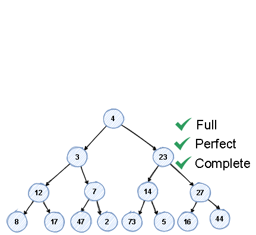
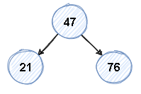
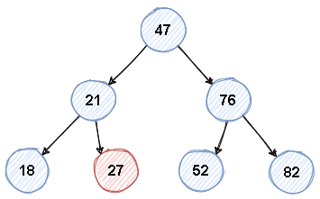
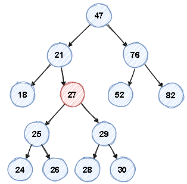
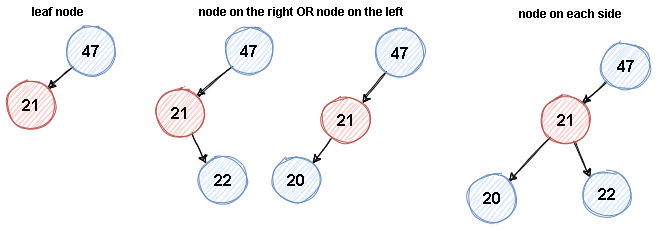
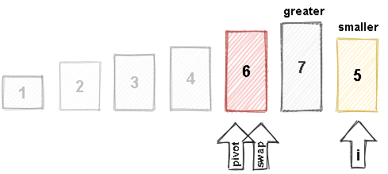
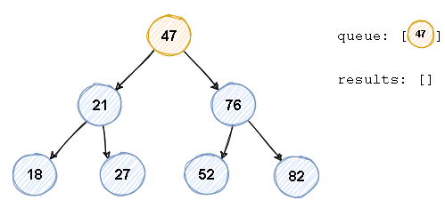
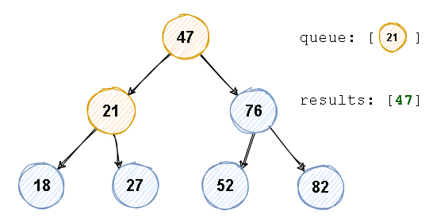

# Data Structures and Algorithms

When two codes accomplish the same thing, how can you compare those? Big O is a way to compare code1 and code2
mathematically about how efficiently they run.

## What is Big O?

Imagine code1 was fully executed in 30 seconds, and code2 took 1 minute to fully execute. Based on this you can say that
code1 is better than code2, this is called Time Complexity.

The funny thing about **Time Complexity** is that is **not measured in time**. Because if you take code2 and run in a 2
times faster computer, it would run in 30 seconds as well. So Time Complexity it's **measured in the number of
operations to complete something**.

In addition, a Time Complexity we measure **Space Complexity**. Let's say code1 runs very fast, but it takes a lot of
memory when it runs. Maybe code2, even taking 1 minute, takes far less memory when it runs.

# Big O

## The Worst Case

In Complexity, we are going to see a lot the greek letters: OMEGA, TETA, OMICRON (O)

Imagine an array:
`[1,2,3,4,5,6,7]`

The best case is if we are looking for number 1, so we use letter OMEGA Ω
`[`**1**`,2,3,4,5,6,7]`

The average case is if we are looking for number 4, so we use letter TETA Θ
`[1,2,3,`**4**`,5,6,7]`

The worst case is if we are looking for number 7, so we use letter OMICRON Ο
`[1,2,3,4,5,6,`**7**`]`

Big O is always to define worst case.

## O(n)

To explain this notation we are going to use a simple method:

    public static void printItems(int n) {
        for(int i=0; i < n; i++) {
            System.out.println(i);
        }
    }

When calling this method we get the output:
`0 1 2 3 4 5 6 7 8 9`

This code is O(n), because we had a number _**n**_, that was 10, and we did **10 operations** on our for loop.


X = n Y = Number of operations

### Drop Constants

For the same method, let's add a second for loop:

    public static void printItems(int n) {
        for(int i=0; i < n; i++) {
            System.out.println(i);
        }
        for(int j=0; j < n; j++) {
            System.out.println(j);
        }
    }

Output:
`0 1 2 3 4 5 6 7 8 9` `0 1 2 3 4 5 6 7 8 9`

In this case we had n+n operations, so we might think that this would be O(2n), but we simplify this by dropping the
constants, so it becomes O(n).

## O(n^2)

To make our function O(n^2) what we have to do is place one for loop inside the other:

    public static void printItems(int n) {
        for(int i=0; i < n; i++) {
            for(int j=0; j < n; j++) {
                System.out.println(i + " " + j);
            }
        } 
    }

Output:

    0 0
    0 1
    0 2
    0 3
    0 4
    ...
    7 6
    7 7
    7 8
    7 9
    8 0
    8 1
    ...
    9 7
    9 8
    9 9

So we passed 10 to the function and we got 100 lines. So the for loops ran n * n times, or n^2. That is O(n^2).

Comparison between O(n) and O(n^2):


O(n^2) grows much faster, that means from a time complexity perspective, it is **less efficient**.

So if you face any code with the complexity of O(n^2), and you can rewrite the code to make it O(n), that's a huge gain
of efficiency.

## Drop Non-dominants

If we add another loop after the nested for loops.

    public static void printItems(int n) {
        for(int i=0; i < n; i++) {
            for(int j=0; j < n; j++) {
                System.out.println(i + " " + j);
            }
        } 
        for(int k=0; k < n; k++) {
            System.out.println(k);
        }
    }

We will see 110 outputs. So when calculating:

- Nested for loop: O(n^2)
- for loop: O(n)

Total would be O(n^2 + n).

Now imagine we use bigger values as input, the n^2 part would be dominant, as it would increase a lot. The n part would
not be so dominant for the end result as the n^2.

So for calculating the complexity we just **drop the non-dominants**.

Final value would be then **O(n^2)**.

## O(1)

Doesn't matter the n value, there will always be ONE operation. For example:

    public static int addItems(int n) {
        return n+n;
    }

As n grows, the **number of operations would stay the same**.

What if we add one more operation?

    public static int addItems(int n) {
        return n+n+n;
    }

That would be O(2), so we can simplify this saying O(1).

The O(1) is also called _**constant time**_, **as n grows the number of operations stays constant.**


## O(log n)

For this we need a sorted array:

`[1,2,3,4,5,6,7,8]`

Let's say we need to find a particular value in this array. We want to find the number **1**.

The quickest way would be to cut the array in half and see if the number 1 is in the first half or in the second.

`[1,2,3,4` `[5,6,7,8]`

As it is not in the second half, we don't need to look at any of there numbers.

`[1,2,3,4`  ~~. [5,6,7,8].~~

Imagine if we had an array with a million values in it, this logic would cut out half a million items we don't have to
look at.

Now we can do the same process again:

`[1,2]` ~~. [3,4].~~

And again:

`[1]` ~~. [2].~~

So we find the number 1 that we were looking for.

If you count now how many steps it took to find the number 1, we see that 3 operations were necessary to find it.

1 - `[1,2,3,4`  ~~. [5,6,7,8].~~

2 - `[1,2]` ~~. [3,4].~~

3 - `[1]` ~~. [2].~~

So took **3 steps** and we had **8 items** in the array.

`2^3 = 8`

if we try to convert this equation to a _log_, we get to:

`log2 8 = 3`

This is basically saying:

- 2 to what power is equal 8? **That's 3**.

or

- If you took the number 8 and repeatedly divided by two, how many times would it take to get down to one item?
  **That's 3 times**

The real power of this is when dealing with very large number:

Imagine

`log2 1.073.741.824 = 3`

How many times would we need to cut this number in half to get down to one item?

You could have an **array with a billion items** in it and find any number in that array in **31 steps**.


## Different Terms for Inputs

Imagine that now we have two parameters instead of one.

    public static void printItems(int a, int b) {
        for(int i=0; i < a; i++) {
            System.out.println(i);

        } 
        for(int j=0; j < b; j++) {
            System.out.println(j);
        }
    }

There is a _gotcha_ on this question. By calculating you would say that's two for loops, so O(n) + O(n).

So we would have _O(2n),_ and by dropping the constant _O(n)_, but that is **NOT CORRECT**. Because this way you are
implying that **a = b = n**, and you can't do that.

We have to say that the first loop is _O(a)_ and the second _O(b)_, so the result would be _**O(a + b)**_.

Same applies if we nested the for loops.

    public static void printItems(int a, int b) {
        for(int i=0; i < a; i++) {
            for(int j=0; j < b; j++) {
                System.out.println(i + " " + j);
            }
        }
    }

The complexity would be _**O(a * b)**_.

We can't just say that they are equal to _n_, **we have to use different terms for different inputs**.

## Array Lists

myList = `[11, 3, 23, 7]`

| values | 11 | 3 | 23 | 7 |
| --- | --- | --- | --- | --- |
| index | 0 | 1 | 2 | 3 |

`myList.add(17)`

| values | 11 | 3 | 23 | 7 | 17 |
| --- | --- | --- | --- | --- | --- |
| index | 0 | 1 | 2 | 3 | 4 |

This _add(17)_ operation didn't require any re-indexing. So it's a **O(1)** operation.

`myList.remove(4)` is a

| values | 11 | 3 | 23 | 7 |
| --- | --- | --- | --- | --- |
| index | 0 | 1 | 2 | 3 |

This _remove(4)_ operation didn't require any re-indexing. So it's a **O(1)** operation as well.

Now if we do: `myList.remove(0)`

| values | 3 | 23 | 7 |
| ---  | --- | --- | --- |
| index | 1 | 2 | 3 |

We notice that the value 3 is no longer at correct index. So we need to re-index.

| values | 3 | 23 | 7 |
| ---  | --- | --- | --- |
| index | `0` | 2 | 3 |

| values | 3 | 23 | 7 |
| ---  | --- | --- | --- |
| index | 0 | `1` | 3 |

| values | 3 | 23 | 7 |
| ---  | --- | --- | --- |
| index | 0 | 1 | `2` |

So we need to **touch every element of the list**.

Same happens if we do: `myList.add(0, 11)`

| values | `11` | 3 | 23 | 7 |
| ---  | --- | --- | --- | --- |
| index | `0` | 0 | 1 | 2 |

| values | 11 | 3 | 23 | 7 |
| ---  | --- | --- | --- | --- |
| index | 0 | `1` | 1 | 2 |

| values | 11 | 3 | 23 | 7 |
| ---  | --- | --- | --- | --- |
| index | 0 | 1 | `2` | 2 |

| values | 11 | 3 | 23 | 7 |
| ---  | --- | --- | --- | --- |
| index | 0 | 1 | 2 | `3` |

Because we had to touch each item, this is O(n).

So it's O(1) on this end to add or remove something.

| values | 11 | 3 | 23 | `7` |
| ---  | --- | --- | --- | --- |
| index | 0 | 1 | 2 | `3` |

But it is O(n) to add/remove on this end. Because of the _re-index_.

| values | `11` | 3 | 23 | 7 |
| ---  | --- | --- | --- | --- |
| index | `0` | 1 | 2 | 3 |

Even if we do: `myList.add(1, 99)`

| values | 11 | `99` | 3 | 23 | 7 |
| ---  | --- | --- | --- | --- | --- |
| index | 0 | `1` | 1 | 2 | 3 |

We are going to touch **all the items after the index** where the add/remove happened.

| values | 11 | 99 | 3 | 23 | 7 |
| ---  | --- | --- | --- | --- | --- |
| index | 0 | 1 | 2 | 3 | 4 |

So that's _**O(n)**_.

What if we do: `myList.find(7)`

| values | `11` |  3 | 23 | 7 |
| ---  | --- | --- | --- | --- |
| index | `0` | 1 | 2 | 3 |

| values | 11 |  `3` | 23 | 7 |
| ---  | --- | --- | --- | --- |
| index | 0 | `1` | 2 | 3 |

| values | 11 |  3 | `23` | 7 |
| ---  | --- | --- | --- | --- |
| index | 0 | 1 | `2` | 3 |

| values | 11 |  3 | 23 | `7` |
| ---  | --- | --- | --- | --- |
| index | 0 | 1 | 2 | `3` |

Looking for a value by value is O(n)

But is different if we are looking by index `myList.get(3)`:

| values | 11 |  3 | 23 | `7` |
| ---  | --- | --- | --- | --- |
| index | 0 | 1 | 2 | `3` |

That would be _**O(1)**_.

## Wrap up Big O

Imagine n = 100:

O(1) = 1

O(log n) ≈ 7

O(n) = 100

O(n^2) = 100

We can clearly see the difference between the values. O(n^2) compared to the others is very inefficient.

Now imagine n = 1000:

O(1) = 1

O(log n) ≈ 10

O(n) = 1000

O(n^2) = 1000000

O(n^2) is going to grow very fast, as we can see.

|        O(1)        | O(log n) |     O(n)     |        O(n^2)      |
| -----------------  | -------- | ------------ | ------------------ |
| Constant | Divide and Conquer | Proportional | Loop within a loop |

## Plus

More information regarding **time complexity of data structures and array sorting algorithms** in the website:

https://www.bigocheatsheet.com/


# Linked Lists

By comparing with an array list, it's

linked lists are dynamic and linked just like array lists, whereas arrays are fixed in length.

linked lists don't have indexes

| 11 |  3 | 23 | 7 |
| --- | --- | --- | --- |

another difference is that with a linked lists, instead of all the items being in a contiguous place in memory, they are
going to be **spread out**.

|  11   |    |  3  |    |  23 |    |  7  |
| ---   | --- | --- | --- | --- | --- | --- |

Linked List is also going to have a variable called **head** that **points to the first node** ad one called **tail**,
that **points to the last node**.

|  11   |    |  3  |    |  23 |    |  7  |
| ---   | --- | --- | --- | --- | --- | --- |
| head  |     |     |     |     |     | tail|

Each node is going to have a **pointer that points to the next node**, and the next, and the next, and so on until we
get to the end.

|  11   |  →  |  3  |  →  |  23 |  →  |  7  |
| ---   | --- | --- | --- | --- | --- | --- |
| head  |     |     |     |     |     | tail|

The **last node** just **points to _NULL_**, but it does have a variable there for the pointer.

If you look at the linked list in memory, is all over the place like this, with each one pointing to the next.


So if we compare this to an **array list**, those **data** structures are going to be in a **contiguous place in
memory**. And that's why on those data structures **we can have indexes**.


## Linked List: Big O

For example, we have a linked list

### `add something to the end`:

|  11   |  →  |  3  |  →  |  23 |  →  |  7  |
| ---   | --- | --- | --- | --- | --- | --- |
| head  |     |     |     |     |     | tail|

The steps that we would do is we are going to have the **last pointing to it**:

|  11   |  →  |  3  |  →  |  23 |  →  |  7  |  →  |  4  |
| ---   | --- | --- | --- | --- | --- | --- | --- | --- |
| head  |     |     |     |     |     | tail|     |     |

The **_tail_ pointer would point to it** as well:

|  11   |  →  |  3  |  →  |  23 |  →  |  7  |  →  |  4  |
| ---   | --- | --- | --- | --- | --- | --- | --- | --- |
| head  |     |     |     |     |     |     |     | tail|

Having in mind that **n** is the number of nodes. So the **steps are going to be the same** if the linked list has 10
items, or it has 1000 items in it.

**it's not going to change based on** **_n_**. Meaning it would be **_O(1)_**.

For removing the last item it can appear to be the same complexity, but it's not

### `remove the last item (4)`:

|  11   |  →  |  3  |  →  |  23 |  →  |  7  |  →  |  4  |
| ---   | --- | --- | --- | --- | --- | --- | --- | --- |
| head  |     |     |     |     |     |     |     | tail|

We need to **point the tail to the item 23**, but from the item 4 perspective, we don't have a pointer to the previous
item.

We can't go backwards in the Linked List.

|  11   |  →  |  3  |  →  |  23 |  →  |  7  |  →  |  ∅  |
| ---   | --- | --- | --- | --- | --- | --- | --- | --- |
| head  |     |     |     |     |     |     |     | tail|

We are going to **need to start at the head and iterate** through the list until we get to the item pointing to _NULL_,
in other words, the **last item**.

|  11   |  →  |  3  |  →  |  23 |  →  |  7  |
| ---   | --- | --- | --- | --- | --- | --- |
| head  |     |     |     |     |     | tail|

Because we had to touch every node and iterate through the list, this is _**O(n)**_.

|  11   |  →  |  3  |  →  |  23 |  →  |  7  |
| ---   | --- | --- | --- | --- | --- | --- |
| head  |     |     |     |     |     | tail|

### `add item to the begining`:

We are going to move the head to the new node

|   4   |     |  11   |  →  |  3  |  →  |  23 |  →  |  7  |
| ---   | --- | ---   | --- | --- | --- | --- | --- | --- |
|  head |     |       |     |     |     |     |     | tail|

And connect the new node to the first item _(11)_.

|   4   |  →  |  11   |  →  |  3  |  →  |  23 |  →  |  7  |
| ---   | --- | ---   | --- | --- | --- | --- | --- | --- |
| head  |     |       |     |     |     |     |     | tail|

So it doesn't matter how much items we have in the linked list. We will always do a fixed number of operations.

Meaning that is _**O(1)**_.

### `remove first item`:

We are going to move the head to the _head.next_ node

|   4   |  →  |  11   |  →  |  3  |  →  |  23 |  →  |  7  |
| ---   | --- | ---   | --- | --- | --- | --- | --- | --- |
|       |     | head  |     |     |     |     |     | tail|

And then we remove the node **4** from the list by pointing it to null.

|   4   |     |  11   |  →  |  3  |  →  |  23 |  →  |  7  |
| ---   | --- | ---   | --- | --- | --- | --- | --- | --- |
|       |     |  head |     |     |     |     |     | tail|

Resulting in:

|  11   |  →  |  3  |  →  |  23 |  →  |  7  |
| ---   | --- | --- | --- | --- | --- | --- |
|  head |     |     |     |     |     | tail|

So it doesn't matter how much items we have in the linked list. We will always do a fixed number of operations.

Meaning that is _**O(1)**_.

### `add item at index 3`:

This means it will be after the **23** node

|  11   |  →  |  3  |  →  |  23 |  →  |  7  |
| ---   | --- | --- | --- | --- | --- | --- |
|  head |     |     |     |     |     | tail|

As our **items are all over the place in memory**, we don't have access through indexes.

So because of that we **start from the head** and iterate through this list and get to a node where **node.next = index
3**.

|  11   |  →  |  3  |  →  |  23 |  →  |  7  |
| ---   | --- | --- | --- | --- | --- | --- |
|  head |     |     |     |  .↑  |     | tail|

When we reach the correct node having the next as index 3 (**23 node**) we point the new node to it.

|  11   |  →  |  3  |  →  |  23 |  →  |  7  |
| ---   | --- | --- | --- | --- | --- | --- |
|       |     |     |     |     |     |  ↑  |
|       |     |     |     |     |     |  4  |
|  head |     |     |     |     |     | tail|

And the node that we are currently (**23 node**) points to the new node (_node.next = 4_).

|  11   |  →  |  3  |  →  |  23 |  →  |  4  |  →  |  7  |
| ---   | --- | --- | --- | --- | --- | --- | --- | --- |
|  head |     |     |     |     |     |     |     | tail|

Because we had to iterate through the list to find the element on index 3, this is **_O(n)_**.

### `remove item at index 3`:

|  11   |  →  |  3  |  →  |  23 |  →  |  4  |  →  |  7  |
| ---   | --- | --- | --- | --- | --- | --- | --- | --- |
|  head |     |     |     |     |     |     |     | tail|

We need to **start from the head** and iterate through this list and get to a node where **node.next = index 3**.

We want the **23** to point to the **7** node, as the **4** points to it, we are going to set the pointer for the **23**
to be equal to that.

And we point the **4** node to _NULL_, so it removes the node from the list.

|  11   |  →  |  3  |  →  |  23 |  →  |  7  |
| ---   | --- | --- | --- | --- | --- | --- |
|  head |     |     |     |     |     |tail |

Because we had to iterate through the list to find the element on index 3, this is **_O(n)_**.

### `look for something by value 23`:

|  11   |  →  |  3  |  →  |  23 |  →  |  7  |
| ---   | --- | --- | --- | --- | --- | --- |
|  head |     |     |     |     |     |tail |

We need to **start from the head** and iterate through this list and get to a node where value is **23**.

Because we had to iterate through the list to find the element on index 3, this is **_O(n)_**.

So it doesn't matter if we look for something by value or by index, it is **O(n)**.

That's one of the places where an Array List is better than a Linked List. Because it has the direct access by index.

` ` - Better

|                 |  Linked List  |  Array List     |
| ---             |        ---    |          ---    |
| Append          |     O(1)      |      O(1)       |
| Remove Last     |     O(n)      |      `O(1)`     |
| Prepend         |     `O(1)`    |      O(n)       |
| Remove First    |     `O(1)`    |      O(n)       |
| Insert          |     O(n)      |      O(n)       |
| Remove          |     O(n)      |      O(n)       |
| Lookup by Index |       O(n)    |      `O(1)`     |
| Lookup by Value |     O(n)      |      O(n)       |

## Under the Hood

We can represent each node in a JSON like this:

    {
        "value"=11,
        "next"= null
    }

Our entire Linked List could be represented by something like:

    head={
            "value"=11,
            "next"= {
                        "value"=3,
                        "next"= {
                                    "value"=23,
                                    "next"= {
                                                "value"=7,
        tail=                                    "next"= null
                                            }
                                }
                    }
        }

|  11   |  →  |  3  |  →  |  23 |  →  |  7  |
| ---   | --- | --- | --- | --- | --- | --- |
|  head |     |     |     |     |     |tail |

## Constructor

Let's implement the constructor for the LinkedList and the Node class:

    public class LinkedList {
        private Node head;
        private Node tail;
        private int length;
    
        public LinkedList(int value){
            Node newListNode = new Node(value);
            head = newListNode;
            tail = newListNode;
            length = 1;
        }
    
        class Node {
            private final int value;
            private Node next;
    
            public Node(int value) {
                this.value = value;
            }
        }
    }

## How to implement reverse() method for a LinkedList


Java code:

    public void reverse() {

        Node temp = head;
        head = tail;
        tail = temp;

        Node after;
        Node before = null;

        for (int i = 0; i < length; i++) {
            after = temp.next;
            temp.next = before;
            before = temp;
            temp = after;
        }
    }

## How to implement "Find Kth from end" method for a LinkedList


Java code:

    public Node findKthFromEnd(int k) {
        Node fastPointer = head;
        Node slowPointer = head;

        for(int i = 0; i < k; i++) {
            if(fastPointer == null) return null;
            fastPointer = fastPointer.next;
        }
        while(fastPointer != null) {
            slowPointer = slowPointer.next;
            fastPointer = fastPointer.next;
        }

        return slowPointer;
    }

## How to implement "Reverse Between indexes" method for a LinkedList

In the LinkedList class, implement a method called reverseBetween that reverses the nodes of the list between indexes m
and n (inclusive).


Java code:

    public void reverseBetween(int m, int n) {
    if(head == null || m == n) return;

        Node dummy = new Node(0);
        dummy.next = head;
        Node prev = dummy;


        for(int i = 0; i < m; i++) {
            prev = prev.next;
        }

        Node current = prev.next;

        for(int i = 0; i < n-m; i++) {
            Node temp = current.next;
            current.next = temp.next;
            temp.next = prev.next;
            prev.next = temp;
        }
        head = dummy.next;
        dummy.next = null;
    }

# Doubly Linked List

They are **very similar to a singly linked list**.

The only difference being that we have arrows that go the other way.

|  11   |  ⇆  |  3  |  ⇆  |  23 |  ⇆  |  7  |
| ---   | --- | --- | --- | --- | --- | --- |
| head  |     |     |     |     |     | tail|

We said we could represent a singly linked list node like thid in JSON:

    {
        "value"=11,
        "next"= null
    }

Meaning that our Node class would be:

    class Node {
    private final int value;
    private Node next;

        public Node(int value) {
            this.value = value;
        }
    }

The only **difference** with the double linked list is that _**it has a pointer to the previous node**_:

    class Node {
    private final int value;
    private Node next;
    private Node prev;

        public Node(int value) {
            this.value = value;
        }
    }

## Constructor

The code for a Doubly Linked List would look like this:

    public class DoublyLinkedList {
    private Node head;
    private Node tail;
    private int length;
    
        public DoublyLinkedList(int value) {
            Node newNode = new Node(value);
            head = newNode;
            tail = newNode;
            length = 1;
        }
    
        public void printList() {
            if (length == 0) {
                System.out.println("{} length: 0");
                return;
            }
            var cursor = head;
            var output = new StringBuilder("{");
            while (cursor != null) {
                output.append(cursor.value + (cursor.next != null ? " -> " : ""));
                cursor = cursor.next;
            }
            output.append("} length: " + length);
            System.out.println(output);
        }
    
        public Node getHead() {
            return head;
        }
    
        public Node getTail() {
            return tail;
        }
    
        public int getLength() {
            return length;
        }
    
        public class Node {
            int value;
            Node next;
            Node prev;
    
            public Node(int value) {
                this.value = value;
            }
    
            public int getValue() {
                return value;
            }
    
            public Node getNext() {
                return next;
            }
    
            public Node getPrev() {
                return prev;
            }
    
            public void setNext(Node next) {
                this.next = next;
            }
    
            @Override
            public String toString() {
                return "{" + value + "}";
            }
        }
    }

## Append method

    public void append(int value) {
        Node newNode = new Node(value);

        if(length == 0) {
            head = newNode;
        } else {
            tail.next = newNode;
            newNode.prev = tail;
        }
        tail = newNode;
    }

## Remove Last

    public Node removeLast() {
        if(length == 0) return null;

        Node removedNode = tail;
        if(length == 1) {
            head = null;
            tail = null;
        } else {
            tail = tail.prev;
            tail.next = null;
            removedNode.prev = null;
        }
        length--;

        return removedNode;
    }

## Prepend

    public void prepend(int value) {
        Node newNode = new Node(value);
        if (length == 0) {
            tail = newNode;
        } else {
            newNode.next = head;
            head.prev = newNode;
        }
        head = newNode;
        length++;
    }

## Remove First

    public Node removeFirst() {
        if (length == 0) return null;

        Node temp = head;

        if(length == 1) {
            head = null;
            tail = null;
        } else {
            head = head.next;
            head.prev = null;
            temp.next = null;
        }

        length--;
        return temp;
    }

## Get by index

Similar to the linked list _get()_ method.

The difference is that we **first check if the index is closer to the end or the beginning**, and based on that we
iterate starting from the **head forward or from the tail backwards**.

    public Node get(int index) {
        if(index < 0 || index >= length) return null;

        Node temp = head;
        // If statement to check if we need to start the loop from **start-to-finish** or from the **end-to-beginning**
        if(index < length/2) {
            for(int i = 0; i < index; i++){
                temp = temp.next;
            }
        } else {
            temp = tail;
            for(int i = length - 1; i > index; i--){
                temp = temp.prev;
            }
        }
        return temp;
    }

## Set - changing the value of a particular node

This is the **only method that is the exact same as the singly linked list**.

But there is a **difference in how the code runs**.

Doubly linked list _get()_ method runs differently (and more **effectively**) then
_get()_ method of the singly linked list.

But the code of this method, is exactly the same.

    public boolean set(int index, int value) {
        Node temp = get(index);
        if (temp != null) {
            temp.value = value;
            return true;
        }
        return false;
    }

## Insert node on index

    public boolean insert(int index, int value) {
        if (index < 0 || index > length) return false;

        if (index == 0) {
            prepend(value);
            return true;
        }

        if (index == length) {
            append(value);
            return true;
        }

        Node newNode = new Node(value);
        Node before = get(index - 1);
        Node after = before.next;

        newNode.prev = before;
        newNode.next = after;
        before.next = newNode;
        after.prev = newNode;

        length++;

        return true;
    }

## Remove by index

    public Node remove(int index) {
        if (index < 0 || index >= length) return null;
        if (index == 0) return removeFirst();
        if (index == length - 1) return removeLast();

        Node temp = get(index);
        temp.next.prev = temp.prev;
        temp.prev.next = temp.next;
        temp.next = null;
        temp.prev = null;
        length--;
        return temp;
    }

## DLL: Swap First and Last

Given a doubly linked list, write a method called swapFirstLast() that swaps the values of the first and last nodes in
the list.

    public void swapFirstLast() {
        if(length < 2) return;

        int temp = head.value;
        head.value = tail.value;
        tail.value = temp;
    }

## Reverse

    public void reverse() {
        Node prev = null;
        while(head != null) {
            Node next = head.next;
            head.next = prev;
            head.prev = next;
            prev = head;
            head = next;
        }
    }

## Palindrome Checker

Write a method to determine whether a given doubly linked list reads the same forwards and backwards.

    public boolean isPalindrome() {
        Node startNode = head;
        Node endNode = tail;
        for (int i = 0; i < length / 2; i++) {

            if (startNode.value != endNode.value) {
                return false;
            }
            startNode = startNode.next;
            endNode = endNode.prev;
        }
        return true;
    }

## Swap Nodes in Pairs

Implement a method called `swapPairs` within the class that swaps the values of adjacent nodes in the linked list. The
method should not take any input parameters.

1-->2-->3-->4--> should become 2-->1-->4-->3-->

    public void swapPairs() {
        if(length <= 1) return;

        Node dummy = new Node(0);
        dummy.next = head;
        head.prev = dummy;

        Node first;
        Node second;
        Node prev = dummy;
        while(head != null && head.next != null) {
            first = head;
            second = head.next;

            prev.next = second;
            first.next = second.next;
            second.next = first;

            second.prev = prev;
            first.prev = second;

            if(first.next != null) {
                first.next.prev = first;
            }

            head = first.next;
            prev = first;
        }
        head = dummy.next;
    }

# Stacks

We can think of a stack as if it was a can of tennis balls.

|   |
| --- |
| ㅤ |
| ㅤ |
| ㅤ |

If we add one ball, or in other words **push an item onto the stack**

|   |
| --- |
| ㅤ |
| ㅤ |
| ◍ |

And another one:

|   |
| --- |
| ㅤ |
| ◍ |
| ◍ |

What makes a stack is that **you can only get to the last item that you pushed** onto the stack.

You can't get the first pushed item _unless you remove the second one_.

Then when you push a third ball:

|   |
| --- |
| ◍ |
| ◍ |
| ◍ |

We can't get to the second one. The **only one we can get to is the one in the TOP**.

That's called **LIFO**. **L**ast **I**n, **F**irst **O**ut.

|   ||
| --- | --- |
| ◍ |reacheable
| ◍ |
| ◍ |

|   ||
| --- | --- |
| ㅤ |
| ◍ |reacheable
| ◍ |

|   ||
| --- | --- |
| ㅤ |
| ㅤ |
| ◍ |reacheable

## Use case

When we navigate using our browser, let's say from facebook to YouTube, and then to instagram and later check our email.

What we are doing is creating a stack, with all the previous websites that we have visited.

|   |
| --- |
| Gmail |
| Instagram |
| YouTubeㅤ |
| Facebookㅤ |

So when we hit the back button we are popping an item off of the stack.

|   |
| --- |
| Instagram |
| YouTubeㅤ |
| Facebookㅤ |

|   |
| --- |
| YouTubeㅤ |
| Facebookㅤ |

## How to implement

### Using Array List

A common way to implement a stack is with an array list. It works better than an array here because we don't know how
many items we're going to be adding to the stack, so it's better to have a dynamic data structure.

| values | 11 | 3 | 23 | 7 |
| --- | --- | --- | --- | --- |
| index | 0 | 1 | 2 | 3 |

So if we add or remove an item to the end of the stack:

| values | 11 | 3 | 23 | 7 | `17` |
| --- | --- | --- | --- | --- | --- |
| index | 0 | 1 | 2 | 3 | `4` |

| values | 11 | 3 | 23 | 7 |
| --- | --- | --- | --- | --- |
| index | 0 | 1 | 2 | 3 |

Both would be O(1) as we don't need to do any other operations life shifting elements, for example.

However, if we add this on the other end:

| values | ~~11~~ | 3 | 23 | 7 |
| --- | --- | --- | --- | --- |
| index | 0 | 1 | 2 | 3 |

We have to do all the re-indexing:

| values |   | 3 | 23 | 7 |
| --- | --- | --- | --- | --- |
| index | 0 | 1 | 2 | 3 |

| values | `3` |  | 23 | 7 |
| --- | --- | --- | --- | --- |
| index | 0 | 1 | 2 | 3 |

| values | 3 | `23` |  | 7 |
| --- | --- | --- | --- | --- |
| index | 0 | 1 | 2 | 3 |

| values | 3 | 23 | `7` ||
| --- | --- | --- | --- |--- |
| index | 0 | 1 | 2 | 3 |

| values | 3 | 23 | 7 |
| --- | --- | --- | --- |
| index | 0 | 1 | 2 |

And to add an item in the same end would require us to do all this _re-indexing_ again.

This brings the **add** and **remove** operations to **_O(n)_** if they are being done at the beginning end of the
stack.

So if we use an array list to implement a stack, **always do the operations at the end, not at the beginning**
of the array list.

Usually stacks are displayed like this

| value |index|
| --- | --- |
| 7 |3
| 23 |2
| 3 |1
| 11 |0


### Using Singly Linked List

Just like an array list we can add/remove items from either ends as long it's the same end.

Our stack could look like this. null terminated end at the bottom of the stack:


Or null terminated end at the beginning of the stack:


So let's analyse which one is better from the Big O perspective:

|  11   |  →  |  3  |  →  |  23 |  →  |  7  |
| ---   | --- | --- | --- | --- | --- | --- |
|  head |     |     |     |     |     | tail|

#### From the end of the linked list

##### Remove:

|  `11`   |  →  |  3  |  →  |  23 |  →  |  7  |
| ---   | --- | --- | --- | --- | --- | --- |
|  `head` |     |     |     |     |     | tail|

|  11   |  →  |  `3`  |  →  |  23 |  →  |  7  |
| ---   | --- | --- | --- | --- | --- | --- |
|  head |     |     |     |     |     | tail|

|  11   |  →  |  3  |  →  |  `23` |  →  |  ~~7~~  |
| ---   | --- | --- | --- | --- | --- | --- |
|  head |     |     |     |     |     | tail|

|  11   |  →  |  3  |  →  |  23 |  →  |  `_NULL_`  |
| ---   | --- | --- | --- | --- | --- | --- |
|  head |     |     |     | `tail`|     | |

|  11   |  →  |  3  |  →  |  23 | 
| ---   | --- | --- | --- | --- | 
|  head |     |     |     | tail|

It's **O(n)** to remove from the end because **we would have to iterate over the items** until we reach the last item
and remove it.

##### Add:

|  11   |  →  |  3  |  →  |  23 | 
| ---   | --- | --- | --- | --- | 
|  head |     |     |     | tail|

|  11   |  →  |  3  |  →  |  23 |  →  |  `7`  | 
| ---   | --- | --- | --- | --- | --- | --- | 
|  head |     |     |     | tail |     |  |

|  11   |  →  |  3  |  →  |  23 |  →  |  7  | 
| ---   | --- | --- | --- | --- | --- | --- | 
|  head |     |     |     |  |     | tail |

It's **O(1)**, as we can just point from the tail to it, and that would put it back on.

#### From the beginning of the linked list

##### Remove:

| ~~11~~|  →  |  3  |  →  |  23 |  →  |  7  |
| ---   | --- | --- | --- | --- | --- | --- |
|  head |     |     |     |     |     | tail|

|  ~~11~~   |  →  |  3  |  →  |  23 |  →  |  7  |
| ---   | --- | --- | --- | --- | --- | --- |
|   |     |  `head`   |     |     |     | tail|

|  3    |  →  |  23 |  →  |  7  |
| ---   | --- | --- | --- | --- |
| head  |     |     |     | tail|

It's **O(1)**, as we just pointed the head to the next item.

##### Add:

|  11   |  →  |  3  |  →  |  23 | 
| ---   | --- | --- | --- | --- | 
|  head |     |     |     | tail|

|  `7`  |  →  |  11   |  →  |  3  |  →  |  23 |
| ---   | --- | ---   | --- | --- | --- | --- |
|       |     |  head |     |     |     | tail |

|  `7`  |  →  |  11   |  →  |  3  |  →  |  23 |
| ---   | --- | ---   | --- | --- | --- | --- |
|`head` |     |       |     |     |     | tail |

|  7  |  →  |  11   |  →  |  3  |  →  |  23 |
| ---   | --- | ---   | --- | --- | --- | --- |
|head |     |       |     |     |     | tail |

It's **O(1)** as well, as we just pointed to the next element after the head and pointed the head to the new added item.

#### Conclusion

This means that from the _Big O_ perspective, using a linked list to implement a stack **doing operations at the
beginning of the linked list is better than at the end of it**.

So when we are using a linked list when implementing a stack we always want it to look like this:

With the **null terminated end at the bottom**.

|  |
| --- |
| **11** |
| ↓ |
| **3** |
| ↓ |
| **23** |
| ↓ |
| **7** |
| ↓ |
| _NULL_ |

Some methods we wrote for the linked list that we can use in our stack:

- `removeFirst()`  - called `pop()` for stack
- `prepend()`  - called `push()` for stack

And we had **_head_** and **_tail_**
| || | --- | --- | | **11** |head| | ↓ || | **3** || | ↓ || | **23** || | ↓ || | **7** |tail| | ↓ || | _NULL_ ||

since we are going to represent a stack vertically, we are going to change those names to
**_top_** and _**bottom**_.

|  ||
| --- | --- |
| **11** |top|
| ↓ ||
| **3** ||
| ↓ ||
| **23** ||
| ↓ ||
| **7** |bottom|
| ↓ ||
| _NULL_ ||

But in a stack we do everything from the top, we don't even need that _**bottom**_ pointer, then.

|  ||
| --- | --- |
| **11** |**top**|
| ↓ ||
| **3** ||
| ↓ ||
| **23** ||
| ↓ ||
| **7** ||

## Constructor

    class Node {
        int value;
        Node next;

        Node(int value) {
            this.value = value;
        }
    }

    class Stack {
        private Node top;
        private int height;

        public Stack(int value) {
            bottom = new Node(value);
            height = 1;
        }

        public void printStack() {
            Node temp = top;
            while(temp != null) {
                System.out.println(temp.value);
                temp = temp.next;
            }
        }

        public Node getTop() {
            return top;
        }
    
        public int getHeight() {
            return height;
        }
    }

## Push

or _prepend_ for a LinkedList First we check if the size is zero, if it is we just set the top to the new node. If not
then the newNode points to the top, and then we set the new top as the newNode.

    public void push(int value) {
        Node newNode = new Node(value);
        if(height == 0) {
            top = newNode;
        } else {
            newNode.next = top;
            top = newNode;
        }
        height++;
    }

But as we can see, we are **checking the height** to **avoid setting the next when we don't have items** in the stack.
For that we can just simplify the code like this:

    public void push(int value) {
        Node newNode = new Node(value);
        if (height != 0) {
            newNode.next = top;
        }
        top = newNode;
        height++;
    }

## Pop

or _removeFirst_ for LinkedList

    public Node pop() {
        if(height == 0) return null;

        Node poppedItem = top;
        top = top.next;
        poppedItem.next = null;

        height--;
        return poppedItem;
    }

# Queues

Is just when you get in line, people can get in line behind you, and when you remove someone from the line, it's always
the first person in line out of the line.

That's **FIFO** = **F**irst **I**n **F**irst **O**ut

**add something to queue** = **enqueued** something

**remove something from the queue** = **dequeued** something

## How to implement

### Using Array List

_dequeue or enqueue_ on the end of the list

|  11 |  3  |  23 |
| --- | --- | --- |
|  0  |  1  |  2  |

|  11 |  3  |  23 |  7  |
| --- | --- | --- | --- |
|  0  |  1  |  2  |  3  |

|  11 |  3  |  23 |
| --- | --- | --- |
|  0  |  1  |  2  |

No re-indexing needed. So it's O(1).

But on the other end, if we do the operations at the beginning of the list.

|  11 |  3  |  23 |
| --- | --- | --- |
|  0  |  1  |  2  |

|  7  |  11 |  3  |  23 |
| --- | --- | --- | --- |
|     |  0  |  1  |  2  |

|  7  |  11 |  3  |  23 |
| --- | --- | --- | --- |
|  `0`  |     |  1  |  2  |

|  7  |  11 |  3  |  23 |
| --- | --- | --- | --- |
|  0  |  `1`  |     |  2  |

|  7  |  11 |  3  |  23 |
| --- | --- | --- | --- |
|  0  |  1  |  `2`  |     |

|  7  |  11 |  3  |  23 |
| --- | --- | --- | --- |
|  0  |  1  |  2  |  `3`  |

We can see that we need to do the _re-indexing for enqueuing and for dequeueing_, this means both operations are **_O(
n)_**.

We could say that for the queue we want to:

- enqueue in the beginning of the list
- dequeue on the end of the list

But we would still have one operation _O(1)_ and another _O(n)_.

And this applies to the other way around as well.

### Using Singly Linked List

#### From the end of the linked list

We need to go through the whole list, until the tail.

|  `11`   |  →  |  3  |  →  |  23 |  →  |  **~~7~~**  |
| ---   | --- | --- | --- | --- | --- | --- |
|  head |     |     |     |     |     | tail|

|  11   |  →  |  `3`  |  →  |  23 |  →  |  7  |
| ---   | --- | --- | --- | --- | --- | --- |
|  head |     |     |     |     |     | tail|

|  11   |  →  |  3  |  →  |  `23` |  →  |  ~~7~~  |
| ---   | --- | --- | --- | --- | --- | --- |
|  head |     |     |     |     |     | tail|

|  11   |  →  |  3  |  →  |  23 |  →  |  `_NULL_`  |
| ---   | --- | --- | --- | --- | --- | --- |
|  head |     |     |     | `tail`|     | |

|  11   |  →  |  3  |  →  |  23 | 
| ---   | --- | --- | --- | --- | 
|  head |     |     |     | tail|

It's **O(n)** to remove from the end because **we would have to iterate over the items** until we reach the last item
and remove it.

Add:

|  11   |  →  |  3  |  →  |  23 | 
| ---   | --- | --- | --- | --- | 
|  head |     |     |     | tail|

|  11   |  →  |  3  |  →  |  23 |  →  |  `7`  | 
| ---   | --- | --- | --- | --- | --- | --- | 
|  head |     |     |     | tail |     |  |

|  11   |  →  |  3  |  →  |  23 |  →  |  7  | 
| ---   | --- | --- | --- | --- | --- | --- | 
|  head |     |     |     |  |     | tail |

It's **O(1)**, as we can just point from the tail to it, and that would put it back on.

#### From the beginning of the linked list

Remove:

| ~~11~~|  →  |  3  |  →  |  23 |  →  |  7  |
| ---   | --- | --- | --- | --- | --- | --- |
|  head |     |     |     |     |     | tail|

|  ~~11~~   |  →  |  3  |  →  |  23 |  →  |  7  |
| ---   | --- | --- | --- | --- | --- | --- |
|   |     |  `head`   |     |     |     | tail|

|  3    |  →  |  23 |  →  |  7  |
| ---   | --- | --- | --- | --- |
| head  |     |     |     | tail|

It's **O(1)**, as we just pointed the head to the next item.

Add:

|  11   |  →  |  3  |  →  |  23 | 
| ---   | --- | --- | --- | --- | 
|  head |     |     |     | tail|

|  `7`  |  →  |  11   |  →  |  3  |  →  |  23 |
| ---   | --- | ---   | --- | --- | --- | --- |
|       |     |  head |     |     |     | tail |

|  `7`  |  →  |  11   |  →  |  3  |  →  |  23 |
| ---   | --- | ---   | --- | --- | --- | --- |
|`head` |     |       |     |     |     | tail |

|  7  |  →  |  11   |  →  |  3  |  →  |  23 |
| ---   | --- | ---   | --- | --- | --- | --- |
|head |     |       |     |     |     | tail |

It's **O(1)** as well, as we just pointed to the next element after the head and pointed the head to the new added item.

#### Conclusion

So to summarize:

- From the end (Add: O(1) Remove: O(n))
- From the beginning (Add: O(1) Remove: O(1))

So as we are implementing a queue, we want to **do each operation in a different end**.

We **don't want to remove from the end, as it's _O(n)_**, so we will **Add on the end** of the linked list.

And what's left is **Remove from the beginning** of the linked list.

This way we make sure all the operations will be O(1).

And instead of head and tail we're going to have **first** and **last**.

|  7  |  →  |  11   |  →  |  3  |  →  |  23 |
| ---   | --- | ---   | --- | --- | --- | --- |
|**first** |     |       |     |     |     | **last** |

## Constructor

    class Node {
        int value;
        Node next;

        Node(int value) {
            this.value = value;
        }
    }

    class Queue {
        private Node first;
        private Node last;
        private int length;

        public Queue(int value) {
            Node newNode = new Node(value);
            first = last = newNode;
            length = 1;
        }
    }

## enqueue()

    public void enqueue(int value) {
        var newNode = new Node(value);
        if (length == 0) {
            first = newNode;
        } else {
            last.next = newNode;
        }
        last = newNode;
        length++;
    }

## dequeue()

    public Node dequeue() {
        if (length == 0) return null;

        Node toBeDequeued = first;
        if (length == 1) {
            first = null;
            last = null;
        } else {
            first = first.next;
            toBeDequeued.next = null;
        }
        length--;
        return toBeDequeued;
    }

# Trees

We've already seen a tree, a Linked List is a tree that doesn't fork.


That would be the same as:

    {
        "value"=4,
        "left"= {
                    "value"=3,
                    "left"= null,
                    "right"= null
                },
        "right"= {
                    "value"=23,
                    "left"= null,
                    "right"= null
                },
    }

As we wrote in way where we can have one node on each side, it means that we can have just **two nodes under a top one**
, and that's what makes it a **binary tree**.

But **there is no rule that a tree has to be a binary tree**. We could have a node pointing to 100 nodes.

### Full tree

It's when every node either points to zero or two nodes.


### Perfect tree

if we remove the last child nodes. The tree will still be **Full**, but now it is a **Perfect** tree.

**Perfect** means that any level on the tree is **completely filed with child nodes**.

Examples of perfect trees:


Not a perfect tree, but **still Full**:


### Complete

A perfect tree is a **complete tree**, being filed from left to right with no gaps.


But if we add a node under the 12 node. The tree will no longer be full, nor perfect. But it would still be **perfect**.


If we add one more node, filling this from left to right, it remains complete, but it is now also **full** now.


But it is not perfect because we haven't filled it all the way across. But if we do:



### Structure


These two child nodes because they _share the same parent_, they are also called **siblings**.


Every node can only have **one parent**.

If you see **two parents sharing a child node**, then is it **not a tree**.

The child nodes of course can also be parent nodes.


And these nodes at the bottom, they don't have any children, and a node that doesn't have children is called **Leaf**.


# Binary Search Tree

Let's say we have one node with 47 in our tree, and we're going to add another node with a binary search tree.

- If the number is greater than parent, it goes on the right.


- if the number is smaller than parent, it goes on the left.


So if we add a node with the value 76. It would look like this:


And if we add another node, but now with the value 52. It is smaller than 47, but as there is already a node added in
the right (the 76), we compare the new node(52) with the 76 node.

And place it on th left, as it's **smaller than 76**.

It would look like this:


Now if we add two nodes with value **21** and **82**:


Adding **18** and **27**:


### Things to point out about BST

- From any node, all nodes below it to the **right** are going to be **greater than** that node.


- From any node, all nodes below it to the **left** are going to be **smaller than** that node.


## Binary Search Tree: Big O

The number of nodes in this tree:


Can be calculated using:

2^1 - 1 = **1**

But if we add a second level of nodes:



The total comes to:
2**^2** - 1 = **3**

And if added a **third** level of nodes:


Can be written as:
2**^3** - 1 = **7**

And as we get into very large number of nodes, that **-1** is insignificant.

So we say that it's **approximately** 2**^3**, 2**^2** and 2**^1**.

Now if we're going to look for a node in this tree:


it's going to take **one step**. Obviously.

So we had **2^1** nodes, and it took us **one step** to find the node.

<br>
Now if we're going to look for number **76** in this tree:


it's going to take **two steps**. So we had **2^2 nodes**, and it took us **two steps** to find a node.

Now if we're going to look for number **27** in this tree:


it's going to take **three steps**. So we had **2^3 nodes**, and it took us **three steps** to find a node.

To **find, add and remove** nodes on this tree it will always be **three steps**.

Meaning that these methods are all **_O(log n)_**. That is very efficient!

So remember, **_O(log n)_ is achieved by doing divide and conquer**.

<br>
<br>

### Divide and Conquer

Let's visualize how we do that by using a bigger tree:


Let's break down how are the steps to find the number **49** in the tree:

Starting from the top of the tree we decide if we need to go left or right:


Based on what we know about Binary Search Trees, **left is for numbers smaller** than the current node, and **right for
greater**:

<br>


So we find ourselves in the 76 node, and just by doing that we made it where **we never have to look at anything that's
on the left** of the **47 node**.

So we are basically removing half of the tree from the search.

That's not a big deal when you have a small tree, but if we had **a million items in the tree**, there would be **half a
million items we would not have to look at**.

Continuing on **search for the node 49**, from where we are we would have to go to the **left**, because _49 is smaller
than 52_.


This time we cut out every node on the right of the 76 node. Because numbers bigger than 76 are irrelevant for our
search.


By going to the left node (_49 is smaller than 52_) we have done the cut out again, but this time there was only the **
node 63** on the right.

And we finally find ourselves in the **node 49** 🎆.

This was: **Divide and Conquer**!

### Worst Case Scenario

For calculating time complexity, so far we have used a perfect tree.

For measuring the best possible scenario we use: **OMEGA Ω**.

But we are more likely to see a tree that looks like this:


Even in this situation we can say that it's roughly **O(log n)**.

But how does a **worst case scenario** look like?

A worse case would be if we had a node, 
and then the next node was greater than and goes **to the right**,
and then the next node was greater than and goes **to the right** as well,
and then the next node was greater than and goes **to the right** as well.

And it just keeps going on and on in a straight line. 


As you can see, a tree that never forks it's essentially a singly linked list.

So if we want to look for the 91 node, how many steps would it take for this tree?

- 47 ❌    1st step
- 76 ❌    2nd step
- 82 ❌    3rd step
- 91 ✅    4th step

It would be four steps, and we have four nodes in the tree. 

That is **O(n)**.

So the **_Big O_** of a Binary Search Tree technically is **O(n)**, **not O(log n)**.

<br>
But what we assume with a Binary Search Tree is that it's not going to be a straight line.

And we treat it as **O(log n)**. Not as a **O(n)** Data structure.

**Technically the Big O for the Binary Search Tree is a O(n), but we treat it as O(log n).**


### Binary Search Tree VS Linked List


All the three methods of a Binary Search Tree are:
- lookup()
- remove()
- insert()

#### lookup()
For finding an item in a linked list, we would have to iterate 
through the entire list until we found the number 91.


That makes it **O(n)**. While the BST is **O(log n)**.

### remove()
For removing an item in a linked list, we would have to iterate
through the entire list until we found the number 91 and remove it.


That makes it **O(n)**. While the BST is **O(log n)**.

### insert()
For inserting, there is **no advantage to keeping it sorted**, because **we would have to go through the list either way** to find an item.

We just **add the item to the end**, and that is actually faster with a linked list.


Inserting into a linked list it's a single step process, so **O(1)**.

Making the _**insert()**_ method faster with a **Linked List** than with a **Binary Search Tree**.

Who is the faster and what:

|  Data Structure |   Linked List and Array List  | Binary Search Tree  |
|         ---     |            --- | ---   |
|  lookup()       |     O(n)          | ✅ **O(n)** treated as **O(log n)**  |
|  remove()       |     O(n)          | ✅ **O(n)** treated as **O(log n)** |
|  insert()       |     ✅ **O(1)**    | O(n) treated as O(log n)      |


## Constructor

Our not would look like this:
```json
    {
        "value"=4,
        "left"= null,
        "right"= null,
    }
```

Those would be our properties for our _Node_ class.
```java
    public class Node {
      int value;
      Node left;
      Node right;
    
      Node(int value) {
          this.value = value;
      }
    }
```
For the _BinarySearchTree_ class, we need to clarify something first:

**Each node has to have a pointer  pointing to it, or it's going to get garbage collected.**


Every node here has something pointing to it except that top node.

That's why on the linked list we have **_head_** pointing to the first node. So the nodes won't get garbage collected.

As we need to do something similar with the tree, we are going to call the pointer to the first node **_root_**.


So the code will look like this:

```java
public class BinarySearchTree {
    private Node root;

    public BinarySearchTree(int value) {
        this.root = new Node(value);
    }
}
```

When implementing a linked list we had a field to control how many items we had in the list.

But the Binary Search Tree we won't do that. 

We can initialize a tree that doesn't have any nodes. And then we add the first node with the _**insert()**_ method.


```java
public class BinarySearchTree {
    private Node root;

    public BinarySearchTree() {
      root = null;
    }
}
```
Because we are not setting the root to any default value, the default value it's null.

So the class don't need a constructor.

```java
public class BinarySearchTree {
    private Node root;

    public Node getRoot() {
        return root;
    }
}

```

## Insert

### Steps

Let's go through the steps before implementing the method:

Let's say we are adding the number 27 to the Binary Search Tree.

- create newNode with value 27.
- if current == null: **insert**
- else:
  - **move to next**: 
    - if newNode < current: **go left**
    - else: **go right**
  

    
- if current == null: **insert**
- else:
  - **move to next**:
    - if newNode < current: **go left**
    - else: **go right**


As you can see, we are repeating the steps, and that means that a while loop is needed here.

So we can re-write the steps as:

- create newNode with value 27.
- _create **temp = root**_
- _while loop_
  - if temp == null: **insert**
  - if newNode < temp: **go left**
    - if temp == null: **insert newNode**
    - else: **move to next node**
  - else: **go right**

<br>

But **if the tree is empty** we don't want to create unnecessary temp variables. So we add a line after the creation
of newNode:

- create newNode with value 27.
- _if root == null then **root = newNode** and **return true**._
- create **temp = root**
- while loop
  - if temp == null: **insert**
  - if newNode < temp: **go left**
    - if temp == null: **insert newNode**
    - else: **move to next node**
  - else: **go right**

Another edge case would be **handling duplication**.
Let's say we want to add the number 76 in our tree.

**We can't insert a value that we already have** in the Binary Search Tree.

So let's add a verification for every iteration:

- create newNode
- if root == null then **root = newNode** and **return true**.
- create **temp = root**
- while loop
  - if newNode == temp **return false**
  - if temp == null: **insert**
  - if newNode < temp: **go left**
    - if temp == null: **insert newNode**
    - else: **move to next node**
  - else: **go right**
  
### Implementing

```java
  public boolean insert(int value) {
      // create newNode
      Node newNode = new Node(value);
      
      // if root == null then root = newNode and return true
      if(root == null) {
          root = newNode;
          return true;
      }
  
      //create temp = root
      Node temp = root;
      
      while(true) {
          // if newNode == temp return false
          if(newNode.value == temp.value) return false;
          
          // if newNode < temp: go left
          if(newNode.value < temp.value) {
              // if temp == null: insert newNode
              if(temp.left == null) {
                  temp.left = newNode;
                  return true;
              }
              // else: move to next node
              temp = temp.left;
              
          // else: **go right**  
          } else {
              // if temp == null: insert newNode
              if(temp.right == null) {
                  temp.right = newNode;
                  return true;
              }
              // else: move to next node
              temp = temp.right;
          }
      }
  }
```

## Contains
It will return true or false based on the presence of the provided item in the tree.

### Steps
Let's break it down in steps first:

- if root == null **return false** (maybe we won't need this step)
- create **temp = root**
- while (temp != null) loop
  - if searchedValue == temp **return true**
  - if searchedValue < temp: **go left**
    - temp = temp.left
  - else if searchedValue > temp: **go right**
    - temp = temp.right
- while loop is done: **return false**

### Implementing

```java
  public boolean contains(int searchedValue) {
      // create temp = root
      Node temp = root;
      while (temp != null) {
          // if searchedValue == temp return true
          if (searchedValue == temp.value) return true;
          
          // if searchedValue < temp: go left
          if (searchedValue < temp.value) {
              temp = temp.left;

          // if searchedValue > temp: go right
          } else {
              temp = temp.right;
          }
      }
      // while loop is done: return false
      return false;
  }
```

If you notice, we didn't include the code for the step:
- if root == null return false

With the code we wrote above:
- **when the root node is null**
- it would be assigned to _temp_ 
- and **would not go inside the loop** because
the condition is _temp != null_
- and then it would **return false**.

# Hash Tables

Let's say we have this address space in memory:

|  address space |    |
| --- | --- | 
|     |  0  | 
|     |  1  | 
|     |  2  | 
|     |  3  | 
|     |  4  | 
|     |  5  | 
|     |  6  | 
|     |  7  | 

We can create this by using an array, and then in this array we are going to store key-value pairs.

Let's imagine an inventory for a hardware store.

Example of key-value pair:

`{ "nails"= 1000 }`

Later we will write the code for a hashmap.


We are going to **run the hash on the key**, from the key-value pair.

So every letter has an ASCII text numerical value, and what we're going to do is run a **calculation on all the numbers 
associated with these letters**. 

The **hash would run on the key and gives us an address**. That is going to be **one of the indexes in the array**, 
and that's **where we store our key value**.


### Some important characteristics of hash:

- It's a ONE WAY process!
  - you can get **2** when passing `"nails"` to the hash.
  - but you **CAN NOT** get `"nails"` when passing **2** to the hash.
- It's **deterministic**:
  - When we **run** `"nails"` through this, we will always get the **same address**.


### Adding items to Hash Table

So let's add more items to our address space, the method signature would look like this: 
`set(key, value)`

So, for `set("nails", 1000)` we got 2:

|  address space |    |
| --- | --- | 
|     |  0  | 
|     |  1  | 
| **{ "nails"= 1000 }**    |  2  | 
|     |  3  | 
|     |  4  | 
|     |  5  | 
|     |  6  | 
|     |  7  | 

For `set("screws", 800)` we got 6:

|  address space |    |
| --- | --- | 
|     |  0  | 
|     |  1  | 
| { "nails"= 1000 } |  2  | 
|     |  3  | 
|     |  4  | 
|     |  5  | 
| **{ "screws"= 800 }** |  6  | 
|     |  7  | 

For `set("nuts", 1200)` we got 2:

We **already have an item on the index 2**, what do we do on this situation?

This situation is called **_a collision_**, because we already have something at the index 2.

What we **don't want** to do is just **overwrite** this. We want to be able to **keep both items** in the index 2.

|  address space |    |
| --- | --- | 
|     |  0  | 
|     |  1  | 
| { "nails"= 1000 } <br> **{ "nuts"= 1200 }** |  2  | 
|     |  3  | 
|     |  4  | 
|     |  5  | 
| { "screws"= 800 } |  6  | 
|     |  7  | 

There are multiple ways of storing multiple items in a particular address. We are going to talk about this later.


For `set("bolts", 1400)` we got 4:

|  address space |    |
| --- | --- | 
|     |  0  | 
|     |  1  | 
| { "nails"= 1000 } <br> { "nuts"= 1200 } |  2  | 
|     |  3  | 
| { "bolts"= 1400 }    |  4  | 
|     |  5  | 
| { "screws"= 800 } |  6  | 
|     |  7  | 

### Getting item from Hash Table

Now that we have our Hash Table filled with some items, let's see how would it work to retrieve an item.

if we call `get("bolts")`:


**Step 1**. We can run `"bolts"` through the same hash map we do when adding an item (`set("bolts", 1400)`).

**Step 2**. And then the hash method will give us the index of **4** for the input _"bolt"_. 
  - Remember that the **hash method is deterministic** so everytime for the same input ("bolts" for e.g.), it will give us the same result (index of **4**).

**Step 3**. Then with the index we can just write the _get method_ to **return the value that's associated with that 
key-value** pair (**1400** on this case). 

The **Step 3** would be a bit more complex if we want to `get("nails")`, because after calculating the **index 2**, 
we would have to iterate through all the keys on that index, and then **return the value associated with the key** **_"nails"_**.

## Collisions
We already talked about one of the ways to deal with collisions.

Where we just **put the next key-value pair at the same address**, even if there's already one there.
This method is called **Separate Chaining**.

`set("nuts", 1200)`:

|  address space |    |
| --- | --- | 
|     |  0  | 
|     |  1  | 
| { "nails"= 1000 } <br> **{ "nuts"= 1200 }** |  2  | 
|     |  3  | 
| { "bolts"= 1400 }    |  4  | 
|     |  5  | 
| { "screws"= 800 } |  6  | 
|     |  7  | 

Another way of doing this is: if there is an item already at the address where we want to put something, 
you just **go to the next open spot and put it there**. 

`set("nuts", 1200)`:

|  address space |    |
| --- | --- | 
|     |  0  | 
|     |  1  | 
| { "nails"= 1000 }  |  2  | 
| **{ "nuts"= 1200 }**    |  3  | 
| { "bolts"= 1400 }    |  4  | 
|     |  5  | 
| { "screws"= 800 } |  6  | 
|     |  7  | 


`set("paint", 50)`:

|  address space |    |
| --- | --- | 
|     |  0  | 
|     |  1  | 
| { "nails"= 1000 }  |  2  | 
| { "nuts"= 1200 }    |  3  | 
| { "bolts"= 1400 }    |  4  | 
| **{ "paint"= 50 }**    |  5  | 
| { "screws"= 800 } |  6  | 
|     |  7  | 

This is called **Linear Probing**. 

And this is one of the types of _**open addressing**_. 

So **Separate Chaining** and **Linear Probing** are the most common way of **dealing with collisions**.

We are going to look more at **Separate Chaining** where we have many key-value pairs at one address.

|  address space |    |
| --- | --- | 
|     |  0  | 
|     |  1  | 
| **{ "nails"= 1000 } <br> { "nuts"= 1200 } <br> { "paint"= 50 }** |  2  | 
|     |  3  | 
| { "bolts"= 1400 }    |  4  | 
|     |  5  | 
| { "screws"= 800 } |  6  | 
|     |  7  | 

The way we will achieve it is by having a **LinkedList on each one of these addresses**.

Linked Lists is a common way of implementing Separate Chaining and putting multiple items at a particular address.

And that's how we are going to deal with Collision.

## Constructor

Let's make a change to our address space.

|  address space |    |
| --- | --- | 
|     |  0  | 
|     |  1  | 
|     |  2  | 
|     |  3  | 
|     |  4  | 
|     |  5  | 
|     |  6  | 
|     |  7  | 

By removing the last index on the bottom:

|  address space |    |
| --- | --- | 
|     |  0  | 
|     |  1  | 
|     |  2  | 
|     |  3  | 
|     |  4  | 
|     |  5  | 
|     |  6  | 

We see that our address space has now **seven indexes** (from 0 to 6).

And the reason why we want to do it is that **we will have fewer
collisions** if our **address space has a prime number of addresses**.

```java
public class HashTable {
    private int size = 7;
    private Node[] dataMap;
    
    public HashTable() {
        dataMap = new Node[size];
    }
    
    public void printTable() {
      for (int i = 0; i < 7; i++) {
        System.out.println(i + ":");
        Node temp = dataMap[i];
        while (temp != null) {
          System.out.println("{ " + temp.key + ":" + temp.value + " }");
          temp = temp.next;
        }
      }
    }
  
    // Node example: { "nails"= 1000 }
    class Node {
        private String key;
        private int value;
        private Node next;
        public Node(String key, int value) {
            this.key = key;
            this.value = value;
        }
    }
    
}
```

Main Class
```java

public class Main {
    public static void main(String[] args) {
        HashTable myHt = new HashTable();

        myHt.printTable();
    }
}

/* EXPECTED OUTPUT

0:
1:
2:
3:
4:
5:
6:

 */

```

## Hash

Some steps that the hash method should have:

1. Get a **key as the parameter**
2. Start the **hash with the value 0**
3. Convert the **key to a char array**
4. Loop through the array of chars
    1. **Assign hash** to:
    
        **hash** plus **ASCII value** of the char **multiplied by a prime number**
        - We multiply it by a prime number because this increases the randomness of the result
        - We chose the prime number 23, so till now, the code would look like: 
                
          `hash = (hash + asciiValue * 23)`
        - Then we use **modulo of the dataMap length** (that in our case is 7).
          `hash = (hash + asciiValue * 23) % dataMap.length`
        - Anything that **we divide by 7**, would have a **remainder value from 0 to 6 at maximum**, that 
          is **exactly our address space**.
        - So this equation is always going to return a number that is one of the indexes in this array.
5. After going through all the characters, we will **return hash**.
    - That is **always going to be a number** that is **0 through 6**. 

<br>
The code for our _hash()_ method would look like this:

```java
    public int hash(String key) {
        int hash = 0;
        char[] keyChars = key.toCharArray();

        for (int i = 0; i < keyChars.length; i++) {
            int asciiValue = keyChars[i];
            hash = (hash + asciiValue * 23) % dataMap.length;
        }
        return hash;
    }
```

## Set

Some steps that the _set_ method should have:

1. **Calculate the index** using _hash(key)_
2. **Create a newNode** using key and value parameters
3. **check dataMap** on the calculated index:
    - **If is null**, then we just assign the newNode
    - **If is not null**, then we go through all the nodes.next.next.next... until we find the last one.
      And then we **point the last node to the newNode**. 

```java    
    public void set(String key, int value) {
        int addressIndex = hash(key);
        Node newNode = new Node(key, value);
        if(dataMap[addressIndex] == null) {
            dataMap[addressIndex] = newNode;
        } else {
            Node temp = dataMap[addressIndex];
            while(temp.next != null){
                temp = temp.next;
            }
            temp.next = newNode;
        }
    }
```

Main Class

```java
public class Main {
    public static void main(String[] args) {
        HashTable myHt = new HashTable();

        myHt.set("nails", 100);
        myHt.set("tile", 50);
        myHt.set("lumber", 80);

        myHt.set("bolts", 200);
        myHt.set("screws", 140);

        myHt.printTable();
    }
}

/* EXPECTED OUTPUT

1:
2:
3:
	{ screws:140 }
4:
	{ bolts:200 }
5:
6:
	{ nails:100 }
	{ tile:50 }
	{ lumber:80 }

 */
```

## Get

Some steps that the _get_ method should have:

1. **Calculate the index** using _hash(key)_
3. **check dataMap** on the calculated index:
  - **If is null**, then return null
  - **If is not null**, then we go through all the nodes looking for the one that matches they given key.
    And then we return the value of that key-value pair. 
    

```java
    public int get(String key) {
        int addressIndex = hash(key);

        Node temp = dataMap[addressIndex];
        while(temp != null){
            if(key.equals(temp.key)) {
                return temp.value;
            }
            temp = temp.next;
        }
        return 0;
    }
```

Main Class

```java
public class Main {
  public static void main(String[] args) {
    HashTable myHt = new HashTable();

    myHt.set("nails", 100);
    myHt.set("tile", 50);
    myHt.set("lumber", 80);

    myHt.printTable();

    System.out.println("Value of lumber: " + myHt.get("lumber"));
    System.out.println("Value of bolts: " + myHt.get("bolts"));
  }
}

/* EXPECTED OUTPUT
0:
1:
2:
3:
4:
5:
6:
	{ nails:100 }
	{ tile:50 }
	{ lumber:80 }
Value of lumber: 80
Value of bolts: 0
*/
```

## Keys

For this method we're going to get all the keys our of the Hash Table, put them in array list and return that array list.

```java
    public ArrayList keys() {
        ArrayList<String> allKeys = new ArrayList<>();

        for (int i = 0; i < dataMap.length; i++) {
            Node temp = dataMap[i];
            while(temp != null) {
                allKeys.add(temp.key);
                temp = temp.next;
            }
        }
        return allKeys;
    }
```

Main Class
```java
public class Main {
    public static void main(String[] args) {
        HashTable myHt = new HashTable();

        myHt.set("nails", 100);
        myHt.set("tile", 50);
        myHt.set("lumber", 80);

        myHt.set("bolts", 200);
        myHt.set("screws", 140);

        myHt.printTable();

        System.out.println("Keys:");
        System.out.println(myHt.keys());
    }
}

/* EXPECTED OUTPUT

0:
1:
2:
3:
	{ screws:140 }
4:
	{ bolts:200 }
5:
6:
	{ nails:100 }
	{ tile:50 }
	{ lumber:80 }
Keys:
[screws, bolts, nails, tile, lumber]
 */
 ```

## Hash Table: Big O


Because the hash method has to be run every time we add an item or we get an item, we have to calculate what's the Big O
of the **_hash()_** method.

The **_hash()_** method is _**O(1)**_ because it will execute the **same number of operations regardless of the number of items** 
that are already in the hash table.

Now let's walk through setting an item:

### `set("washers", 1000)`:
- We would **run it through our hash method**, and it would give us the **address 0**.
- Using this index we would assign the key-value pair to the calculated address.
  
That is a single step, so the set method is **O(1)**.


### `get("screws", 1000)`:
- We would **run it through our hash method**, and it would give us the **address 6**.
- Using this index we would **directly access the address 6** and return the value of the pair in there.

That is a single step, so could we say that the **get method is _O(1)_?**


Hmmmmmm. Before answering this question, how would the `get("screws", 1000)` looks like if our hash table looked like this:


- We would **run it through our hash method**, and it would give us the **address 2**.
- Using this index we would **directly access the address 2**.
- And then we have to **iterate through the entire list of pairs** to find the one with the 
  **matching key** and **return the value from the pair**.
  
You would **think that this would be _O(n)_**, but when working with the hash table **we assume that the hash method** is going 
to **create very random addresses**, and your hash table is going to look something more like this:


A very good hash method means:
- Having **a larger address space**.
- **Randomizing** where the items are put.

And because of that we treat **getting** an item and **setting** an item in a **hash table as _O(1)_**.

## Interview question

How can we write a code to check if the following two arrays have an item in common?

|  1  |  3  |  5  |
| --- | --- | --- | 
|  **3**  |  **4**  |  **5**  |  

The most simple solution is using nested for loops. But that would be the inefficient way. Let's see why:

```java
public class Main {
  public static void main(String[] args) {
    int[] array1 = {1, 3, 5};
    int[] array2 = {2, 4, 5};

    System.out.println(itemInCommon(array1, array2));
  }

  public static boolean itemInCommon(int[] array1, int[] array2) {
    for (int i : array1) {
      for (int j : array2) {
        if (i == j) return true;
      }
    }
    return false;
  }
}
```

if we check the _itemInCommon()_ method we see that we had to do **nested loops** for checking the existence of first 
array items in the second one. So the Big O for this solution is **O(n²)**.

Now let's see how we can do this much more efficiently, with a Hash Table.

```java
    public static boolean itemInCommon(int[] array1, int[] array2) {
        Hashtable<Integer, Boolean> hs = new Hashtable();
        for (int i : array1) {
            hs.put(i, true);
        }
        for (int j : array2) {
            if(hs.get(j) != null) return true;
        }
        return false;
    }
```

We can see that now we are:
- **first populating a Hash Table** with all the items in the first array 
- in the second for loop we just **call the get for each of its elements** 
  - if the _get()_ returns is **not null** it means the element is 
**contained in the Hash Table**, so we **return true**.
    
So we have two not nested for loops. This makes it O(2n), and by dropping the constant we end up with **_O(n)_**.

# Graphs

To look at graphs we first we need to understand two concepts:

## Basic concepts
- a Vertex or a Node.

  _plural: vertices_
- an Edge or Connection


In the image above we can see that the **vertex 3** can have an edge with many vertices. 
  Meaning that **there is no limit to how many other vertices a vertex can connect to.**

Let's say do you want to go **from 76 to 82**.

You would say that you don't want to go from 76 to 44 to 82 because that would be **two hops**.


You will probably say that the best way to do it is from 76 to 82, because that
would need a single hop.


**Most of the time** want to go the **most direct route**.

Why not every single time? 
Some graphs can have **weighted edges**. 

## Edges
### Weighted and Non-weighted

The best path would be the one with **less accumulated weight**.

Imagine this same graph but with weights:


Now the **direct path would cost us 15**. And the longer path would accumulate **only 5**.

To bring this into the real world, let's think about starting point and destination in a Google Maps.

I want to go to the **Barber**. What would be the **quickest way** I can get there?


If I go the **direct path to the Barber**, it would **cost me 25 minutes**. Because probably that street is having some bad traffic.

But in the other hand, If I do the path where I **pass by the mall**. It would take me a **total of 5 minutes** to the to my Barber.

So in this case, **the longest path was the fastest one**.

### Directional or bidirectional

Another important concept of graphs is that when we see an edge without any arrows, it means it's a **bidirectional edge**.

A bidirectional example would be in facebook connections.

Your friend is friends with you and you are friends with your friend.

So it's a bidirectional edge. It goes both ways.


Now on twitter or instagram, when you follow a celebrity:


You are following the celebrity, but they don't follow you back. **That is directional**.


## Trees are graphs

Trees are a form of graph, but they have the **limitation** that **each node can only point to two** other nodes **directionally**.


### Linked Lists are Trees
Linked Lists are a form of a Tree.


So if:

`Linked List = Tree `

`Tree = Graph`

Therefore:

`Linked List = Graph`

**Linked List is a form o a Graph** with the limitation that **each node can only point to one**, directionally.

## Representing a graph 

### Adjacency Matrix

Let's represent this graph in an Adjacency Matrix.


let's start from the **A vertex**. It has two edges with **B and E**, so we are
going to fill those with **1s**.


|       | A | B | C | D | E |
| ---   |---|---|---|---|---|
| **A** |   | `1`  |   |   | `1` |
| **B** |   |   |   |   |   |
| **C** |   |   |   |   |   |
| **D** |   |   |   |   |   |
| **E** |   |   |   |   |   |

And of course in an adjacency matrix **A can not have a vertex with itself**, so we put a 0 there.

|       | A | B | C | D | E |
| ---   |---|---|---|---|---|
| **A** | `0`  | 1 |   |   | 1 |
| **B** |   |   |   |   |   |
| **C** |   |   |   |   |   |
| **D** |   |   |   |   |   |
| **E** |   |   |   |   |   |

A **does not have an edge with C and D**, so we fill it with **0s**.

|       | A | B | C | D | E |
| ---   |---|---|---|---|---|
| **A** | 0  | 1 | `0` | `0` | 1 |
| **B** |   |   |   |   |   |
| **C** |   |   |   |   |   |
| **D** |   |   |   |   |   |
| **E** |   |   |   |   |   |

That's it for vertex A. 

Now let's do the same for **vertex B**:

|       | A | B | C | D | E |
| ---   |---|---|---|---|---|
| **A** | 0 | 1 | 0 | 0 | 1 |
| **B** | 1 | 0 | 1 | 0 | 0 |
| **C** |   |   |   |   |   |
| **D** |   |   |   |   |   |
| **E** |   |   |   |   |   |

And so on until we complete our matrix.

|       | A | B | C | D | E |
| ---   |---|---|---|---|---|
| **A** | 0 | 1 | 0 | 0 | 1 |
| **B** | 1 | 0 | 1 | 0 | 0 |
| **C** | 0 | 1 | 0 | 1 | 0 |
| **D** | 0 | 0 | 1 | 0 | 1 |
| **E** | 1 | 0 | 0 | 1 | 0 |

So this axis represents the actual vertex.

|       | A | B | C | D | E |
| ---   |---|---|---|---|---|
| `A` | 0 | 1 | 0 | 0 | 1 |
| `B` | 1 | 0 | 1 | 0 | 0 |
| `C` | 0 | 1 | 0 | 1 | 0 |
| `D` | 0 | 0 | 1 | 0 | 1 |
| `E` | 1 | 0 | 0 | 1 | 0 |

And this axis is the items it has an edge with.

|       | `A` | `B` | `C` | `D` | `E` |
| ---   |---|---|---|---|---|
| **A** | 0 | 1 | 0 | 0 | 1 |
| **B** | 1 | 0 | 1 | 0 | 0 |
| **C** | 0 | 1 | 0 | 1 | 0 |
| **D** | 0 | 0 | 1 | 0 | 1 |
| **E** | 1 | 0 | 0 | 1 | 0 |

An interesting thing about adjacency matrix, that we said that:

- **A can't point to A**
- **B can't point to B** ...

We are **always** going to have this **45 degree line of zeros**.

|       | A | B | C | D | E |
| ---   |---|---|---|---|---|
| **A** | `0` | 1 | 0 | 0 | 1 |
| **B** | 1 | `0` | 1 | 0 | 0 |
| **C** | 0 | 1 | `0` | 1 | 0 |
| **D** | 0 | 0 | 1 | `0` | 1 |
| **E** | 1 | 0 | 0 | 1 | `0` |

And if we have a bidirectional matrix like we have in the example, 
we will **always have a mirror image** on each of the sides 
of the line. That looks like that:

|       | A | B | C | D | E |
| ---   |---|---|---|---|---|
| **A** | 0 | `1` | 0 | 0 | `1` |
| **B** | `1` | 0 | `1` | 0 | 0 |
| **C** | 0 | `1` | 0 | `1` | 0 |
| **D** | 0 | 0 | `1` | 0 | `1` |
| **E** | `1` | 0 | 0 | `1` | 0 |

But this is only if these are bidirectional.

To exemplify that, let's change the direction of an edge and build the matrix for it:
Now A points to B but B is not pointing back.


The matrix would look like:

|       | A | B | C | D | E |
| ---   |---|---|---|---|---|
| **A** | 0 | **1** | 0 | 0 | **1** |
| **B** | `0` | 0 | **1** | 0 | 0 |
| **C** | 0 | **1** | 0 | **1** | 0 |
| **D** | 0 | 0 | **1** | 0 | **1** |
| **E** | **1** | 0 | 0 | **1** | 0 |

As you can see, on the cell **B -> A** we **have a zero** now. So we have **lost our symmetry** across that 45 degree line.

#### Weighted Edges
Now let's say that our edges have weights:


So if edges are weighted in an adjacency matrix, we will just store these weights in the matrix:


|       | A | B | C | D | E |
| ---   |---|---|---|---|---|
| **A** | 0 | `2` | 0 | 0 | `10` |
| **B** | `2` | 0 | `4` | 0 | 0 |
| **C** | 0 | `4` | 0 | `6` | 0 |
| **D** | 0 | 0 | `6` | 0 | `8` |
| **E** | `10` | 0 | 0 | `8` | 0 |

### Adjacency List

Adjacency List is just another way of representing a graph.

And we'll do this by **using a HashMap**.

- **Key**: the vertex
- **Value**: a list with all the edges.


Would look something like this:

```json
{
  "A" = ["B", "E"]
}
```

Ps: Notice that we are using letters but the content of the node could be any String, not only a single character.

So the **entire graph** would look like this:
```json
{
  "A" = ["B", "E"],
  "B" = ["A", "C"],
  "C" = ["B", "D"],
  "D" = ["C", "E"],
  "E" = ["A", "D"]
}
```

## Graph: Big O

As we have seen before, there are two ways of representing a graph,
as an **Adjacency Matrix** and as an **Adjacency List**.

We are going to look at the Big O of both.

### Space Complexity

In an Adjacency List we are going to store that vertex and each one of the edges.
```json
{
  "A" = ["B", "E"],
  "B" = ["A", "C"],
  "C" = ["B", "D"],
  "D" = ["C", "E"],
  "E" = ["A", "D"]
}
```

In an Adjacency Matrix we store those edges, but we also have to store everything that 
it is **not connected** to, **all of these zeros**:

|       | A | B | C | D | E |
| ---   |---|---|---|---|---|
| **A** | `0` | 1 | `0` | `0` | 1 |
| **B** | 1 | `0` | 1 | `0` | `0` |
| **C** | `0` | 1 | `0` | 1 | `0` |
| **D** | `0` | `0` | 1 | `0` | 1 |
| **E** | 1 | `0` | `0` | 1 | `0` |

And that is a **big advantage of the adjacency list**.

Space complexity for 
- **Adjacency Matrix**: 
    - Number of vertices squared: **O( |V|² )**

- **Adjacency List**: 
    - Number of vertices plus number of edges: **O( |V| + |E| )**
  
From a **Space Complexity perspective**, the **adjacency list is better**.

### Adding an Vertex

Imagine we want to add a new **vertex F** to our graph. Not connected to anything.


#### Adjacency List
In order to add a new vertex it's just a matter of adding it into the list:
```json
{
  "A" = ["B", "E"],
  "B" = ["A", "C"],
  "C" = ["B", "D"],
  "D" = ["C", "E"],
  "E" = ["A", "D"],
  "F" = []
}
```

#### Adjacency Matrix
Now with the matrix we have to add a bidimensional array to the matrix:

|       | A | B | C | D | E | `F`|
| ---   |---|---|---|---|---|---|
| **A** | 0 | 1 | 0 | 0 | 1 | `0` |
| **B** | 1 | 0 | 1 | 0 | 0 | `0` |
| **C** | 0 | 1 | 0 | 1 | 0 | `0` |
| **D** | 0 | 0 | 1 | 0 | 1 | `0` |
| **E** | 1 | 0 | 0 | 1 | 0 | `0` |
| `F` | `0` | `0` | `0` | `0` | `0` | `0` |

As soon as we make the arrays bigger, you have to create new arrays that are bigger.
And recreating those arrays if very inefficient.

#### Conclusion

From a Big O perspective:
- Adjacency Matrix: **O( |V|² )**
- Adjacency List: **O( 1 )**

So the **adjacency list** is much **more efficient** at **adding items**.

### Adding an Edge

Let's now see how complex it is to **add an edge** **between B and F vertex**.

#### Adjacency List
In order to add a new edge, we need to add the "F" vertex into the "B" edge list, and vice-versa.
```json
{
  "A" = ["B", "E"],
  "B" = ["A", "C", "F"],
  "C" = ["B", "D"],
  "D" = ["C", "E"],
  "E" = ["A", "D"],
  "F" = ["B"]
}
```

#### Adjacency Matrix
For the matrix we just need to change the values **from zero to one** on the **B → F** and **F → B** cells

|       | A | B | C | D | E | F|
| ---   |---|---|---|---|---|---|
| **A** | 0 | 1 | 0 | 0 | 1 | 0 |
| **B** | 1 | 0 | 1 | 0 | 0 | `1` |
| **C** | 0 | 1 | 0 | 1 | 0 | 0 |
| **D** | 0 | 0 | 1 | 0 | 1 | 0 |
| **E** | 1 | 0 | 0 | 1 | 0 | 0 |
| **F** | 0 | `1` | 0 | 0 | 0 | 0 |

#### Conclusion
From a Big O perspective, both adjacency matrix and adjacency list are **O( 1 )** to **add an edge**.


### Remove an Edge
How complex it would be to **remove the edge** **between B and F vertex** that we've just added?

#### Adjacency List
In order to remove the edge between B and F, we need to:
- Find B in the hash map
- Then iterate through the edge list and remove F from it
- And then Find F in the hash map
- Then iterate through the edge list and remove B from it
```json
{
  "A" = ["B", "E"],
  "B" = ["A", "C"],
  "C" = ["B", "D"],
  "D" = ["C", "E"],
  "E" = ["A", "D"],
  "F" = []
}
```

#### Adjacency Matrix
In a matrix we just need to change the values **from one to zero** on the **B → F** and **F → B** cells.

|       | A | B | C | D | E | F|
| ---   |---|---|---|---|---|---|
| **A** | 0 | 1 | 0 | 0 | 1 | 0 |
| **B** | 1 | 0 | 1 | 0 | 0 | `0` |
| **C** | 0 | 1 | 0 | 1 | 0 | 0 |
| **D** | 0 | 0 | 1 | 0 | 1 | 0 |
| **E** | 1 | 0 | 0 | 1 | 0 | 0 |
| **F** | 0 | `0` | 0 | 0 | 0 | 0 |

#### Conclusion
From a Big O perspective:
- Adjacency Matrix: **O( 1 )**
- Adjacency List: **O( E )** 
  - We have to go through all the edges, and a particular vertex might have 1000 edges and we would 
    have to go through the entire array list to remove the edge.  

So this is a situation where the **adjacency matrix outperforms the adjacency list**.

### Remove a Vertex

Let's **remove the vertex F**

#### Adjacency List
In order to remove the vertex F, we need to:
- Remove F from the hash map
- Then **iterate through the entire adjancency list**, checking the 
  edge lists to see if we need to **remove any edge between the 
  removed F vertex** and other vertex.
```json
{
  "A" = ["B", "E"],
  "B" = ["A", "C"],
  "C" = ["B", "D"],
  "D" = ["C", "E"],
  "E" = ["A", "D"],
  "F" = []
}
```

#### Adjacency Matrix
In a matrix we have to remove the bidirectional array and rewrite the arrays.

|       | A | B | C | D | E |
| ---   |---|---|---|---|---|
| **A** | 0 | 1 | 0 | 0 | 1 |
| **B** | 1 | 0 | 1 | 0 | 0 |
| **C** | 0 | 1 | 0 | 1 | 0 |
| **D** | 0 | 0 | 1 | 0 | 1 |
| **E** | 1 | 0 | 0 | 1 | 0 |

#### Conclusion
From a Big O perspective:
- Adjacency Matrix: **O( |V|² )**
- Adjacency List: **O( |V| + |E| )**
  - In other words, we have to touch every vertex and every edge

So for removing a vertex the **adjacency list outperforms the adjacency matrix**.

### Which one is better?

We talked about Adjacency Matrix **not being so space efficient**, because there we have to **store all the not connected edges**.

And that becomes **incredibly inefficient when working with large graphs**.

That's why we are going to **work** more with the **Adjacency List representation**. 😃

## Constructor
The constructor for Graph class is very simple. It is just going to create an empty hash map
that will be used to store our adjacency list.

```java
public class Graph {
    private HashMap<String, ArrayList<String>> adjList = new HashMap<>();
}
```

## Add Vertex
Basically our method is going to create a stand alone 
vertex. And later we will implement the adding edges method.

For now our hash map is going to look like this:

```json
{
  "A" = []
}
```

A important detail is that we  need to check if the vertex being added
is **already in the graph**, if not we **add and return true**, if it is we **do nothing and return false**.

The code will look like this:

```java
private boolean addVertex(String vertex) {
    if (adjList.containsKey(vertex)) {
        adjList.put(vertex, new ArrayList<>());
        return true;
    }
    return false;
  }
```

## Add Edge

This method is going to take two vertices, that would look like this:

```json
{
  "A" = [],
  "B" = []
}
```

and then add an edge between them, that would look like this:

```json
{
  "A" = ["B"],
  "B" = ["A"]
}
```

That is basically this diagram:


The steps to adding an edge should be:

- **get _vertex1_ value** in the hashmap (that will be basically it's adjacency list)
- **get _vertex2_ value** in the hashmap
- check if both are not null (meaning that vertex exists)
- add vertex2 to vertex1 adjacency list, and vice-versa.

```java
public boolean addEdge(String vertex1, String vertex2) {

    ArrayList<String> vertex1EdgeList = adjList.get(vertex1);
    ArrayList<String> vertex2EdgeList = adjList.get(vertex2);

    if(vertex1EdgeList != null && vertex2EdgeList != null) {
        vertex1EdgeList.add(vertex2);
        vertex2EdgeList.add(vertex1);
        return true;
    }
    return false;
}
```

## Remove Edge

This method is going to take **two vertices** that are the ones being **connected by the edge to be removed**.

The steps to removing an edge should be:


- **get _vertex1_ value** in the hashmap (that will be basically it's adjacency list)
- **get _vertex2_ value** in the hashmap
- **check** if both are **not null** (meaning that vertex exists)
- **remove vertex2 from vertex1 edgeList**
- **remove vertex1 from vertex2 edgeList**

```java
public boolean removeEdge(String vertex1, String vertex2) {

    ArrayList<String> vertex1EdgeList = adjList.get(vertex1);
    ArrayList<String> vertex2EdgeList = adjList.get(vertex2);

    if(vertex1EdgeList != null && vertex2EdgeList != null) {
        vertex1EdgeList.remove(vertex2);
        vertex2EdgeList.remove(vertex1);
        return true;
    }
    return false;
}
```

## Remove Vertex

Imagine a graph like the following:


That would be represented by:

```json
{
  "A" = ["B", "C", "D"],
  "B" = ["A", "D"],
  "C" = ["A", "D"],
  "D" = ["A", "B", "C"]
}
```

Let's say that we want to remove the **"D" vertex**. For that we first grap "D" ajacency list:
`"D" = ["A", "B", "C"]`

And we can loop throgh those vertices and remove "D" from their adjacency list. So we would endup with:

```json
{
  "A" = ["B", "C"],
  "B" = ["A"],
  "C" = ["A"],
  "D" = ["A", "B", "C"]
}
```

And then we just remove "D" from the graph:

```json
{
  "A" = ["B", "C"],
  "B" = ["A"],
  "C" = ["A"],
}
```

And our graph would look like this:


So the steps to removing an edge should be:
- **get _vertex1_ value** in the hashmap (that will be basically it's adjacency list)
- as we are talking about **bidirectional graphs**, we can **go through all the vertices** in the **adjacency list** and
  **remove _vertex1_ from their** adjacency list
- and then **remove the vertex** from our graph

The code would look like this:

```java
public boolean removeVertex(String vertex) {
    ArrayList<String> vertexAdjList = adjList.get(vertex);

    if(vertexAdjList == null) return false;

    for (String otherVertex : vertexAdjList) {
        adjList.get(otherVertex).remove(vertex);
    }

    adjList.remove(vertex);
    return true;
}
```
# Heap
A heap looks like a Binary Search Tree, but the numbers are laid out differently.

Each node has a value that is greater than all of its descendants, and because of that, the **maximum value** is always 
going to be **at the top**.


Key characteristics:
- Heap tree will **always be complete**.
- We can have **duplicates**.

This is a particular type of heap called **MAX HEAP**, where the **maximum value is at the top**.


We can also have **MIN HEAP**, where the **minimum value is at the top**.


Other than the **maximum value being at the top** there is **no particular order to the other nodes**.


The biggest difference between heap and bst, is how we implement it. 

We are going to implement Heap with an ArrayList and no Node class. 

Basically we store integers in the array.

So this heap:


Could be represented as an array list like this:

|  99  |  72  |  61   |  58  |  55  | 27  |  18 |
| ---  | ---  | ---   | ---  | ---  | --- | --- |
|  0   |  1   |   2   |  3   |   4  |  5  |  6  |

Or another common way of doing it, is leaving the first index open and move everything to the right.

|  ✖   |  99  |  72  |  61   |  58  |  55  | 27  |  18  |
| ---  | ---  | ---  | ---   | ---  | ---  | --- | ---  |
|  0   |  1   |   2  |   3   |   4  |   5  |  6  |  7   |

We can think of this tree like this:


That's why the tree need to the **complete tree**. Otherwise if we had something like:


The array would look like:

|  ✖   |  99  |  72  |  61   |  58  |  ✖  | 27  |  18 |
| ---  | ---  | ---  | ---   | ---  | ---  | --- | --- |
|  0   |  1   |   2  |   3   |   4  |   5  |  6  |  7  |

It has to be a **contiguous set of numbers**. With no gaps.

## Index calculation
For finding a specific element child/parent, we will use a bit of math. 

Again, keep in mind that a heap will be always a complete tree.

### How do we find a specific children?

Let's say we want to find the children of the item 72, how do we do it?

First, let's describe all the array indexes of those elements.


We can notice that we can write a formula to find a specific index.


This means that to find a specific child, you can use:

**leftChild** = 2 * parentIndex

**rightChild** = 2 * parentIndex + 1

We know that **72 index is 2**, so we can just apply the formula.

**leftChild** = 2 * 2 = **4**

**rightChild** = 2 * 2 + 1 = **5**

|  ✖   |  99  |  72  |  61   |  `58`  |  `55`  | 27  |  18  |
| ---  | ---  | ---  | ---   | ---  | ---  | --- | ---  |
|  0   |  1   |   2  |   3   |   **4**  |   **5**  |  6  |  7   |

### How do we find a parent a node?
If there is a formula to calculate the children indexes, then the 
formula to find the parent index should be the opposite formula.

So if we are in those children and we want to know the parent index.


**from leftChild (27):** parentIndex = childIndex/2 = 6/2 = **3**

**from rightChild (18):** parentIndex = childIndex/2 = 7/2 _(int)_ =  **3**

We are going to use **integer division**, so we don't care about 
everything to the right of the decimal place.

|  ✖   |  99  |  72  |  `61`   |  58  |  55  | 27  |  18  |
| ---  | ---  | ---  | ---   | ---  | ---  | --- | ---  |
|  0   |  1   |   2  |   **3**   |   4  |   5  |  6  |  7   |

So the parent is the number 61.

## Insert Introduction

Imagine we have to insert the value 100 in the following heap:


You would think we might insert it at the top, but it doesn't 
matter what the value is, we will always **insert it in the right 
place to keep the heap a complete tree**. 

As we said before, heap will always be a complete tree.


After inserting it we will **compare it to its parent**, if it's 
**greater** we will **swap these two values**. And **repeat until we 
find a parent with greater value or if we reach the top**.


On this case, we stopped comparing because we **reached the top** of the heap.

Let's try to add the value 75 now:


Here we stopped because we found a **parent** (100) that was **greater** than 75.

How would process looks like in an array manner. Have in mind that heap is implemented using an array.

Let's see the first case, of adding 100 to the following heap:


That can be represented by this array:


First we need to find the parentIndex using the formula we talked about:


After **finding the parentIndex** we compare parent(72) to new item(100), and we **swap those as parent is smaller** than 100.

We **repeat this process** one more time, and then we reach the **top of the heap**:


Now let's see the process for **adding the number 75**.
Would look like this in the tree.


All the steps on an array, would look like this:

Calculating the parentIndex and comparing the value we noticed that the parent is smaller, so we need swap.


And then we do it again, but we don't swap as the parent is greater than 75.


So we end up with the array like this:

|  ✖   |  100  |  99  |  75   |  58  |  72  | 61  |
| ---  | ---  | ---  | ---   | ---  | ---  | --- |
|  0   |  1   |   2  |   3   |   4  |   5  |  6  |

So far we have been leaving the index of 0 free. But **when we implement the insert method we are going to use the index 0**.

## Implementation

### Constructor
```java
public class Heap {
    private List<Integer> heap;

    public Heap() {
        this.heap = new ArrayList<>();
    }

    public List<Integer> getHeap(){
      return new ArrayList<>(heap);
    }
}
```

### Helper methods
We need to implement the methods having the formulas for finding child and parent indexes of a given element.

```java
private int leftChild(int index) {
    // we have to do (index + 1) due to the fact that we 
    // are going to use the 0 index position in  the array.
    return 2 * index + 1;
}
    // we have to do (index + 2) due to the fact that we 
    // are going to use the 0 index position in  the array.
private int rightChild(int index) {
    return 2 * index + 2;
}

private int parent(int index) {
    // we have to do (index - 1) due to the fact that we 
    // are going to use the 0 index position in  the array.
    return (index - 1) / 2;
}

private void swap(int index1, int index2) {
    int temp = heap.get(index1);
    heap.set(index1, heap.get(index2));
    heap.set(index2, temp);
}
```

### Insert

```java
public void insert(int num){
    heap.add(num);

    int currentIndex = heap.size() - 1;
    if(heap.size() >= 2) {
        // we stop the loop if we reach the top
        while(currentIndex > 0) {
            int parentIndex = parent(currentIndex);
            // or if we find a parent with a greater value
            if(heap.get(currentIndex) <= heap.get(parentIndex)) break;
            swap(parentIndex, currentIndex);
            currentIndex = parentIndex;
        }
    }
}
```

### Remove
For the Heap we always remove the top item. It doesn't matter if it's a maxHeap or minHeap.

The first step is removing the top item:


Now we have to keep the tree complete, and the only node we can move to make the tree complete is the bottom node to the top.


After having the complete tree. We have to make it a valid heap. So we have to sink the 65 node down,
by comparing to see which child has the highest value, and then we swap positions with it.


And then we do it again, but as 65 is greater than 60, we will stop there.

So for sinking down the node we are going to need a helper function.

#### sinkDown 

```java
private void sinkDown(int index) {
        int maxIndex = index;
        while(maxIndex < heap.size()) {
            int leftChildIndex = leftChild(maxIndex);
            int rightChildIndex = rightChild(maxIndex);

            // if the calculated index exists and the value in there is greater, we save it's index
            if(leftChildIndex < heap.size() && heap.get(leftChildIndex) > heap.get(maxIndex)) {
                maxIndex = leftChildIndex;
            }

            // if the calculated index exists and the value in there is greater than our current
            // maxIndex, we save it's index
            if (rightChildIndex < heap.size() && heap.get(rightChildIndex) > heap.get(maxIndex)) {
                maxIndex = rightChildIndex;
            }

            // if we changed maxIndex, then we swap. If not it means we couldn't find a
            // child with greater value, so we break the loop.
            if(maxIndex != index) {
                swap(index, maxIndex);
                index = maxIndex;
            } else {
                return;
            }
        }
    }
```


#### remove
```java
public Integer remove() {
    if(heap.size() == 0) return null;
    if(heap.size() == 1) {
        return heap.remove(0);
    }

    int maxValue = heap.get(0);
    // here we set the top as the removed last item.
    heap.set(0, heap.get(heap.size() - 1));
    
    // we sink the top down
    sinkDown(0);

    return maxValue;
}
```

## Priority Queue
Priority queues are usually implemented using heap. Ofter you will hear people using terms like priority queue and heap 
as if they were the same thing.

In a Priority Queue we want to return the **highest priority item in the queue**. 

We can already see why heap it's almost always used to implement a priority queue.

It all comes down to _Big O_. 

Technically you could implement the priority queue with a linked list, 
but returning the maximum value requires that we go through the entire 
list, and that's _**O(n)**_.

You could also implement using a simple array list, with numbers in a 
random order. We would have to go through the entire list, and that's _**O(n)**_ as well.

Same would happen with the hash map, we would have to iterate through all the values. Making it _**O(n)**_ once again.

If we use a Binary Search Tree we can always go to the node at far right. That would be _**O(log n)**_. But that's only
the case if the tree is balanced. If not it would be pratically a single linked list, making it _**O(n)**_.

With a Heap the tree is always balanced. So we would have the unbalanced tree issue.

To understand the Big O of the heap we need to understand how to calculate the height of the heap.

`n = number of elements`

`height = log(n)`


So for this tree the height would be:
`height = log(8) = 3`

Knowing the height is log(n), imagine we remove an item from the heap.


The item we put on top (50) was so small that it had to be sinkDown the entire height of the tree (log (n)).

Same would happen if we inserted the item 100.


We would have to bubble it up the entire height of the tree (log (n)).

So it doesn't matter if we are doing **insert or remove**, it will be **always** _**O(log n)**_.

If we had a heap with a 1.000.000 items:

`n = 1000000`

`height = log(n) = 20`

So it's a **huge difference in efficiency**. That's why you will almost see a heap being used with priority queues.  

# Recursion

## Introduction
A good definition of recursion would be:

**It's a method that calls itself... until it doesn't.**

We can represent that concept using the **gift box analogy**.

Inside a gift box, could be a **smaller gift box or a ball**:


The method `openGiftBox()`, it can return another gift box or a ball.

So let's say that inside the first gift box we **found another gift box**, so we can call the `openGiftBox()` method on the **inner gift box**.


Once again, by calling `openGiftBox()` we can get a smaller gift box or a ball.


The gift box finally have a ball inside it! Obviously we are not going to run `openGiftBox()` on the ball, which brings us back to the definition in the beginning.

**It's a method that calls itself... until it doesn't.**

It doesn't call itself **once we get to the ball**.

How would be a pseudocode for this example we talked about:

```java
public static Ball openGiftBox() {
    if(isBall) return ball;
    openGiftBox();
}
```

The situation that causes the method to stop calling itself is named **Base Case**.

The situation where the method is going to call itself again is named **Recursive Case**.


When using **recursion** you **ALWAYS have** to have a **Base Case**.

You can imagine what would happen, right? 
- We would be opening a gift box
  - and then again
    - and then again
      - and then again
        - and then again
          - and then again
  
I won't say that would be happening endlessly, because that would be a moment you would get a _StackOverflowError_.

But what if the base case was:

```java
public static Ball openGiftBox() {
    if(1 > 2) return ball;
    openGiftBox();
}
```

1 would never be greater than 2, so **that is not a base case**. 

A base case **has to be true at some point**.

Another important aspect of recursive method is that it **has to have a return statement**, because that cause the 
code to **stop running**.

```java
public static Ball openGiftBox() {
    if(isBall) 
        System.out.println("Hello");
    openGiftBox();
}
```

The output of the example above would be something like:
```
  Hello
  Hello
  Hello
  Hello
  Hello
  Hello
  Hello
  ...
```

Because as we are no calling `return`, we are calling `openGiftBox()` again and again....

## Call Stack

Just like the STACK data structure we implemented [here](#stacks), the call stack is not different.

Just like the tennis balls example.

|   |
| --- |
| ◍ |
| ◍ |
| ◍ |

If we have a method that is running, that's the method at the top of the stack. 

When it gets done running, it is only then that the next method can start running again until it finishes.

Let's visualize these methods in the code:

The first `methodOne()`:
```java
public static void methodOne() {
    System.out.println("One");
}
```
Would look like this in the stack:


Now let's say that `methodOne()` calls `methodTwo()`:
```java
public static void methodThree() {
    System.out.println("Three");
}
public static void methodTwo() {
    methodThree();
    System.out.println("Two");
}
public static void methodOne() {
    methodTwo();
    System.out.println("One");
}
```
Would look like this in the stack:


Now let's say that `methodTwo()` calls `methodThree()`:
```java
public static void methodThree() {
    System.out.println("Three");
}
public static void methodTwo() {
    methodThree();
    System.out.println("Two");
}
public static void methodOne() {
    methodTwo();
    System.out.println("One");
}
```
Would look like this in the stack:


Since `methodThree()` is at the top of the call stack, it's the only method that can run.

So we'll print out:
```
Three
```

And now that `methodThree()` is done running, we can pop it from the call stack:


Since `methodTwo()` is at the top of the call stack, let's run it.

So our output looks currently like:
```
Three
Two
```


And now that `methodTwo()` is done running, we can pop it from the call stack:


Since `methodOne()` is at the top of the call stack, let's run it.

So our output looks currently like:
```
Three
Two
One
```

And now that `methodOne()` is done running, we can pop it from the call stack:


That's it, no more method to execute.

Notice that the order that we called our methods was:

```
methodOne();
methodTwo();
methodThree();
```

but it printed out:
```
Three
Two
One
```

That's because the output is the **order that the methods popped off** from the call stack.

## Factorial

A very common example of recursive problem for teaching recursion.

- **4!** is basically **4 * 3 * 2 * 1**, that is **24**.

- **3!** is basically **3 * 2 * 1**, that is **6**.
  - so we could say that **4!** is basically **4 * 3!**.
- **2!** is basically **2 * 1**, that is **2**.
- **1!** is different, it is just **1**.

It is similar to the gift box analogy. 

We **call the factorial until** we reach our **base case, that is 1!** that gives us **1**.

Some conditions we saw to be able to use recursion:
1. You have to be doing the **same thing over and over**.
2. The **problem** needs to be **getting smaller**.

```java
public static int factorial(int n) {
    if(n == 1) return 1;
    return n * factorial(n - 1);
}
```

The place where we say `return n * factorial(n - 1);` that is basically the **4 * 3!** situation explained above.

So the calling steps in the code would look like this:

```java
factorial(4)

return 4 * factorial(3)

return 3 * factorial(2)

return 2 * factorial(1)

return 1
```

And when returning it would look like this:
```java
factorial(4)

return 4 * factorial(3)

return 3 * factorial(2)

return 2 * 1
```
```java
factorial(4)

return 4 * factorial(3)

return 3 * 2
```
```java
factorial(4)

return 4 * 6
```

```java
factorial(4) = 24
```

If we represent this the same way we did with the drawing stack, it would look like this:


So the entire code for the factorial in Java would be:

```java
public class Factorial {
    public static void main(String[] args) {
        System.out.println(factorial(4)); // 24
    }
    public static int factorial(int n) {
        if(n == 1) return 1;
        return n * factorial(n - 1);
    }
}

```

# Recursive Binary Search Tree

## What we already have
For now, we are going to basically copy everything from the Binary Search Tree.

So we would have the RecursiveBinarySearchTree class like this:

```java
public class RecursiveBinarySearchTree {
    private Node root;

    public Node getRoot() {
        return root;
    }

    public boolean contains(int searchedValue) {
      if (root == null) return false;
  
      Node temp = root;
      while (temp != null) {
        if (searchedValue == temp.value) return true;
        if (searchedValue < temp.value) {
          temp = temp.left;
        } else {
          temp = temp.right;
        }
      }
      return false;
    }
  
    public boolean insert(int value) {
        Node newNode = new Node(value);
        if (root == null) {
            root = newNode;
            return true;
        }

        Node temp = root;
        while (true) {
            if (newNode.value == temp.value) return false;

            if (newNode.value < temp.value) {
                if (temp.left == null) {
                    temp.left = newNode;
                    return true;
                }
                temp = temp.left;
            } else {
                if (temp.right == null) {
                    temp.right = newNode;
                    return true;
                }
                temp = temp.right;
            }
        }
    }


    public void printTree() {
        PrintUtils.printTree(this);
    }

    public class Node {
        int value;
        Node left;
        Node right;

        Node(int value) {
            this.value = value;
        }

    }
}

```
## Contains
If you check the **class above** we can see that when we first implemented the method `contains()` of the **Binary Search Tree** [here](##contains), we did it iteratively,
 in other words, we used a loop to go through the nodes.

Now we are going to **write this method recursively**.

Let's remember what are the steps for this method, but adjusting them for the recursion:

- currentNode = root
- if currentNode == null return false **(base case)**
- if searchedValue == temp return true **(base case)**
- if searchedValue < temp: **go left**
    - call `rContains(currentNode.left, searchedValue)`
  - else if searchedValue > temp: **go right**
    - call `rContains(currentNode.right, searchedValue)`
  
We are going to create a **private recursive method** `rContains()`that will be called from the `contains()`.

You will understand why shortly.

How the method `contains()` is going to look like now:

```java
public boolean contains(int searchedValue) {
    return rContains(root, searchedValue);
}
```

We needed a new method because the **signature for the recursive** method **required a node to be passed** as a parameter.

And the `rContains()` method will look like:

```java
private boolean rContains(Node currentNode, int searchedValue) {
    if(currentNode == null) return false;

    if(currentNode.value == searchedValue) return true;

    if (searchedValue < currentNode.value) {
        return rContains(currentNode.left, searchedValue);
    } else {
        return rContains(currentNode.right, searchedValue);
    }
}
```

Now when we run the following Main class:

```java
public class Main {
    public static void main(String[] args) {
        RecursiveBinarySearchTree rbst = new RecursiveBinarySearchTree();

        rbst.insert(47);
        rbst.insert(21);
        rbst.insert(76);
        rbst.insert(18);
        rbst.insert(27);
        rbst.insert(52);
        rbst.insert(82);

        rbst.printTree();
        System.out.println("Contains 27: "+ rbst.contains(27));
        System.out.println("Contains 17: "+ rbst.contains(17));
    }
}
```
We get te following output:

```text
      47       
  21       76   
18   27   52   82 
Contains 27: true
Contains 17: false
```

## Insert

Time to re-write the `insert()` method recursively.

It would be the same logic as it was for the `contains()` method. We would need an `rInsert()` private recursive method.

`insert()` method:
```java
public boolean insert(int value) {
    root = rInsert(root, value);
    return true;
}

```

Let's go through the steps for inserting recursively:
- currentNode = root
- if currentNode == null return new Node(value) **(base case)**
- if searchedValue < temp: **we know we are going to insert in the left leg**
  - currentNode.left = `rInsert(currentNode.left, value)`
    - if we are not in the moment of adding the new node, the currentNode.left will just point to the same node it was pointing to .
- else if searchedValue > temp: **we know we are going to insert in the right leg**
  - currentNode.right = `rInsert(currentNode.right, value)`
    - if we are not in the moment of adding the new node, the currentNode.right will just point to the same node it was pointing to. 


`rInsert()` method will look like:

```java
private Node rInsert(Node currentNode,int value) {
    if (currentNode == null) {
        return new Node(value);
    }
    if (value < currentNode.value) {
        currentNode.left = rInsert(currentNode.left, value);
    } else {
        currentNode.right = rInsert(currentNode.right, value);
    }
    return currentNode;
}
```

Now when we run the following Main class:
```java
public class Main {
    public static void main(String[] args) {
        RecursiveBinarySearchTree rbst = new RecursiveBinarySearchTree();

        rbst.insert(47);
        rbst.insert(21);
        rbst.insert(76);
        rbst.insert(18);
        rbst.insert(27);
        rbst.insert(52);
        rbst.insert(82);

        rbst.printTree();
    }
}
```

We get te following output:
```text
      47       
  21       76   
18   27   52   82 
```

## Delete

### Introduction
Let's say we have the following tree, and we want to **remove the node 27**.



For deleting a node we need to go through some steps:  
1. First need to **traverse through the tree** in order to **find the node** to be removed.


2. Now that we are in the node, we have to **be able to delete it**.
  - But what if this node is a **parent node**? **How do we delete it**?
    - Let's say if there was a left child (subtree):
      
      
  
      For this case we just move the left child(and it's children) up.
      
      

    - If there was a subtree on the right:
  
      
      
      The logic is the same as the single left subtree. We just **move the right subtree up**.
  
      
    
    - If we have a subtree on each side (two children), it gets a bit more complicated.
    
    

    We can't just move one of the subtrees up, because we have two.

    We are going to **look at the right subtree**, and find for the **node with the lowest value**.

    

    That's going to be the **28 node**.
    
    And then we are going to **copy that value of 28 into the to-be-removed node**.
    
    

    So we are **NOT moving** the 28 node up. We are just **changing the value of the to-be-removed** node to 28.

    After doing that we are left with two 28 nodes, so now what's left to do is **remove the second 28 node**.

    

    And now this is a valid binary search tree.
    
### Implementing

Let's first tackle the step 1, that is to **traverse through the tree** in order to **find the node** to be removed.

```java
public void deleteNode(int value) {
    deleteNode(root, value);
}

private Node deleteNode(Node currentNode, int value) {
    if(currentNode == null) return null;

    if (value < currentNode.value) {
        currentNode.left = deleteNode(currentNode.left, value);
    } else if (value > currentNode.value) {
        currentNode.right = deleteNode(currentNode.right, value);
    } else {
        // if node found, do nothing.    
    }
    return currentNode;
}
```


This code until now, **will traverse the tree recursively** and do nothing if the node with the specified value is found.

Now the Step 2, we have to **be able to delete** the node we traversed to.

The node about to be deleted can have tree scenarios:



We are going to implement the **first two** first, as they are simpler:

- leaf node
- node on the right OR node on the left

#### Leaf node

Here we need to **check if there are no children** and if not then we just **return null**.

As it's a recursive call, the **caller will be assigned** to the return value (**null**), so the value will be **removed from the tree**.
```java
private Node deleteNode(Node currentNode, int value) {
    if(currentNode == null) return null;

    if (value < currentNode.value) {
        currentNode.left = deleteNode(currentNode.left, value);
    } else if (value > currentNode.value) {
        currentNode.right = deleteNode(currentNode.right, value);
    } else {
        // Leaf node check
        if(currentNode.left == null && currentNode.right == null) {
            return null;
        }
    }
    return currentNode;
}
```

#### Single child node

For a single child node, we just need to move up the child. That will be basically return the
child, as we are in a recursive method, the called will point to the return of the method.

```java
private Node deleteNode(Node currentNode, int value) {
    if(currentNode == null) return null;

    if (value < currentNode.value) {
        currentNode.left = deleteNode(currentNode.left, value);
    } else if (value > currentNode.value) {
        currentNode.right = deleteNode(currentNode.right, value);
    } else {
        // Leaf node check
        if(currentNode.left == null && currentNode.right == null) {
            return null;
        // If there is a right child, move it up    
        } else if(currentNode.left == null) {
                currentNode = currentNode.right;
        // If there is a left child, move it up
        } else if(currentNode.right == null) {
            currentNode = currentNode.left;
        }
    }
    return currentNode;
}
```

#### Each side child

As we already saw, for removing a parent that has a child node on each side, we first need
to **look at the right node subtree**, and find for the **node with the minimum value**.

So let's implement a private method to **check for the minimum value** in a subtree.

```java
private int minValue(Node currentNode) {
    while(currentNode.left != null) {
        currentNode = currentNode.left;
    }

    return currentNode.value;
}
```

So for this tree:
```java
      47       
  21       76   
18   27   52   82 
```

if we call **minValue for node 47** and **minValue for node 76**, we should get:
```text
minValue for node 47: 18
minValue for node 76: 52
```

Now let's write the code to delete the node when it has a child on each side.

- As now we have the `minValue()` method, we just need to call it on the right child to find the minimum
- Then **change the value of the currentNode to the minimum**
- and then  we call the `deleteNode()` for the minimum **passing the right child as root** of the subtree, this way we are 
going to **remove the minimum from the subtree**.


```java
private Node deleteNode(Node currentNode, int value) {
    if(currentNode == null) return null;

    if (value < currentNode.value) {
        currentNode.left = deleteNode(currentNode.left, value);
    } else if (value > currentNode.value) {
        currentNode.right = deleteNode(currentNode.right, value);
    } else {
        // Leaf node check
        if(currentNode.left == null && currentNode.right == null) {
            return null;
        // If there is a right child, move it up    
        } else if(currentNode.left == null) {
                currentNode = currentNode.right;
        // If there is a left child, move it up
        } else if(currentNode.right == null) {
            currentNode = currentNode.left;
        // If there is a node on each side, we switch the to-be-removed node 
        // with the minimum value and remove the minimum from the subtree
        } else {
            int subTreeMin = minValue(currentNode.right);
            currentNode.value = subTreeMin;
            currentNode.right = deleteNode(currentNode.right, subTreeMin);
        }
    }
    return currentNode;
}
```

Let's build a tree and test this out!


This is what the main class will look like, for building this tree:

```java
public class Main {
    public static void main(String[] args) {
        RecursiveBinarySearchTree rbst = new RecursiveBinarySearchTree();

        rbst.insert(47);
        rbst.insert(21);
        rbst.insert(76);
        rbst.insert(18);
        rbst.insert(27);
        rbst.insert(52);
        rbst.insert(82);
        rbst.insert(25);
        rbst.insert(24);
        rbst.insert(26);
        rbst.insert(29);
        rbst.insert(30);
        rbst.insert(28);

        rbst.printTree();
    }
}
```

And this is the output of the `printTree()` method we use for visualization:
```text
                              47                               
              21                               76               
      18               27               52               82       
                  25       29                                   
                24   26   28   30                                 
```


Let's say we want to **remove node 27**. 

So by our understanding what needs to happen is **27 will be changed to the minimum** 
value of the right subtree (that's 28). And then we will **remove 28 from the right subtree**.

This is what our tree will look like after **removing node 27**.


When running the code we get the following output:

```text
1   Before removing:
2                              47                               
3              21                               76               
4      18               27               52               82       
5                  25       29                                   
6                24   26   28   30                                 
7   After removing:
8                              47                               
9              21                               76               
10      18               28               52               82       
11                  25       29                                   
12                24   26       30                                 

```

As you can see in the line 12, we removed the 28 node and change the value of the node 27 to 28 (line 10).

With this we finish implementing the delete method, finally. 

It **seems more complicated than it actually is**. It's just a matter of breaking it down into smaller steps and implementing 
each one separately.


# Algorithms

## Bubble Sort

Bubble Sort is one of the most basic sorting algorithm. It works like this:

Imagine we have the following unsorted array:

|  `4`   |  2  |  6 |  5  |  1  |  3  |
| ---   | --- | --- | --- | --- | --- |

- Start from the first item(4) with the second one(2), if the first is bigger then we switch places.
  
  |  2   |  `4`  |  6 |  5  |  1  |  3  |
  | ---   | --- | --- | --- | --- | --- |
  
- Now we compare the second item with the next item (6), and as it is smaller, we move to the third item.
  
  |  2   |  4  |  `6` |  5  |  1  |  3  |
  | ---   | --- | --- | --- | --- | --- |
  
- Now we compare the third item with the next item (5), and as it is bigger, we switch positions.

  |  2   |  4  |  5 |  `6`  |  1  |  3  |
  | ---   | --- | --- | --- | --- | --- |

- Now we compare the fourth item with the next item (1), and as it is bigger, we switch positions.

  |  2   |  4  |  5 |  1  |  `6`  |  3  |
    | ---   | --- | --- | --- | --- | --- |

- Now we compare the fifth item with the next item (3), and as it is bigger, we switch positions.
  
  |  2   |  4  |  5 |  1  |  3  |  `6`  |
  | ---   | --- | --- | --- | --- | --- |

- And now the `6` is sorted. So it means that whatever is the **biggest number**, we are going to **bubble it up to the top**.
- So this took us 5 steps to get the `6` all the way to the top, is an array of 6 elements.

- Now we start over. From the first item(2) with the second one(4), and as it is smaller, we move to the second item.
  
  |  2   |  `4`  |  5 |  1  |  3  |  6  |
  | ---   | --- | --- | --- | --- | --- |
  
- The second item(4) with the third (5), and as it is smaller, we move to the third item.
  
  |  2   |  4  |  `5` |  1  |  3  |  6  |
  | ---   | --- | --- | --- | --- | --- |

- The third item(5) with the fourth (1), and as it is bigger, we switch positions.

  |  2   |  4  |  1 |  `5`  |  3  |  6  |
    | ---   | --- | --- | --- | --- | --- |

- And again:

  |  2   |  4  |  1 |  3  |  `5`  |  6  |
      | ---   | --- | --- | --- | --- | --- |

- Now the second biggest item has been bubbled up to the top.
And that only took **4 steps**. So each time we go through this we will **take fewer steps**.
  
Probably you understood the idea of the algorithm. 
You can see the whole flow in the gif bellow.
  


### Code

BubbleSort class:
```java
public class BubbleSort {
    public static void bubbleSort(int[] array) {
        for (int i = array.length - 1; i > 0; i--) {
            for(int j = 0; j < i; j++) {
                // switching items
                if(array[j] > array[j + 1]) {
                    int temp = array[j];
                    array[j] = array[j+1];
                    array[j+1] = temp;
                }
            }
        }
    }
}
```

Main class:
```java
public class Main {
    public static void main(String[] args) {
        int[] array = {4, 2, 6, 5, 1, 3};
        BubbleSort.bubbleSort(array);
        System.out.println(Arrays.toString(array));
    }
}
```

That when executed outputs:
```text
[1, 2, 3, 4, 5, 6]
```

## Selection Sort
Imagine we have the following unsorted array:

|  `4`   |  2  |  6 |  5  |  1  |  3  |
| ---   | --- | --- | --- | --- | --- |
|  0   |  1  |  2 |  3  |  4  |  5  |
- Start from the first item(4) we first assign zero to a variable called **minIndex** that will keep the **index of the smaller number**.


  |  `4`   |  2  |  6 |  5  |  1  |  3  |
  | ---   | --- | --- | --- | --- | --- |
  |  0   |  1  |  2 |  3  |  4  |  5  |
  `minIndex = 0`

- Now we loop through the array until we find a smaller number.
  
  |  `4`   |  `2` |  6 |  5  |  1  |  3  |
  | ---   | --- | --- | --- | --- | --- |
  |  0   |  1  |  2 |  3  |  4  |  5  |
  `minIndex = 1`

  
  |  4   | `2` |  `6` |  5  |  1  |  3  |
  | ---  | --- | --- | --- | --- | --- |
  |  0   |  1  |  2 |  3  |  4  |  5  |
  `minIndex = 1`

  |  4   | `2` |  6 |  `5`  |  1  |  3  |
  | ---  | --- | --- | --- | --- | --- |
  |  0   |  1  |  2 |  3  |  4  |  5  |
  `minIndex = 1`

  |  4   | `2` |  6 |  5  |  `1`  |  3  |
  | ---  | --- | --- | --- | --- | --- |
  |  0   |  1  |  2 |  3  |  4  |  5  |
  `minIndex = 1`

  |  4   | 2 |  6 |  5  |  `1`  |  `3`  |
  | ---  | --- | --- | --- | --- | --- |
  |  0   |  1  |  2 |  3  |  4  |  5  |
  `minIndex = 4`

  |  4   | 2 |  6 |  5  |  `1`  |  3  |
  | ---  | --- | --- | --- | --- | --- |
  |  0   |  1  |  2 |  3  |  4  |  5  |
  `minIndex = 4`

- Once we finish looping through we know our **minIndex is 4**. 
So what we do is we **swap the first item and the minIndex item (fifth item)**.

- Now the first item is already ordered, so we can start from the second.

  |  1   | `2` |  6 |  5  |  4  |  3  |
  | ---  | --- | --- | --- | --- | --- |
  |  0   |  1  |  2 |  3  |  4  |  5  |
  `minIndex = 1`

  |  1   | `2` |  `6` |  5  |  4  |  3  |
  | ---  | --- | --- | --- | --- | --- |
  |  0   |  1  |  2 |  3  |  4  |  5  |
  `minIndex = 1`

  |  1   | `2` |  6 |  `5`  |  4  |  3  |
  | ---  | --- | --- | --- | --- | --- |
  |  0   |  1  |  2 |  3  |  4  |  5  |
  `minIndex = 1`

  |  1   | `2` |  6 |  5  |  `4`  |  3  |
  | ---  | --- | --- | --- | --- | --- |
  |  0   |  1  |  2 |  3  |  4  |  5  |
  `minIndex = 1`

  |  1   | `2` |  6 |  5  |  4  |  `3`  |
  | ---  | --- | --- | --- | --- | --- |
  |  0   |  1  |  2 |  3  |  4  |  5  |
  `minIndex = 1`

- We finish looping through, and our **minIndex remained 1**. So no items need to be swapped.
- Now the **first and second items are ordered**, so we can **start from the third**.

  |  1   | 2 |  `6` |  5  |  4  |  3  |
  | ---  | --- | --- | --- | --- | --- |
  |  0   |  1  |  2 |  3  |  4  |  5  |
  `minIndex = 2`
  
  |  1   | 2 |  `6` |  `5`  |  4  |  3  |
  | ---  | --- | --- | --- | --- | --- |
  |  0   |  1  |  2 |  3  |  4  |  5  |
  `minIndex = 2`
  
  |  1   | 2 |  6 |  `5`  |  4  |  3  |
  | ---  | --- | --- | --- | --- | --- |
  |  0   |  1  |  2 |  3  |  4  |  5  |
  `minIndex = 3`
  
  |  1   | 2 |  6 |  `5`  |  `4`  |  3  |
  | ---  | --- | --- | --- | --- | --- |
  |  0   |  1  |  2 |  3  |  4  |  5  |
  `minIndex = 3`
  
  |  1   | 2 |  6 |  5  |  `4`  |  3  |
  | ---  | --- | --- | --- | --- | --- |
  |  0   |  1  |  2 |  3  |  4  |  5  |
  `minIndex = 4`
  
  |  1   | 2 |  6 |  5  |  `4`  |  `3`  |
  | ---  | --- | --- | --- | --- | --- |
  |  0   |  1  |  2 |  3  |  4  |  5  |
  `minIndex = 4`  
  
  |  1   | 2 |  6 |  5  |  4  |  `3`  |
  | ---  | --- | --- | --- | --- | --- |
  |  0   |  1  |  2 |  3  |  4  |  5  |
  `minIndex = 5`

- We finish looping through, and our **minIndex is 5**.
  So what we do is we **swap the third item and the minIndex item (sixth item)**.

  |  1   | 2 |  `3` |  5  |  4  |  6  |
  | ---  | --- | --- | --- | --- | --- |
  |  0   |  1  |  2 |  3  |  4  |  5  |

- Now the **first, second and third items are ordered**, so we can **start from the fourth**.

- We keep on doing this until we get the array sorted. 
  
Here it is a GIF that demonstrate the whole process.


### Code

SelectionSort class:
```java
public class SelectionSort {
    public static void selectionSort(int[] array) {
        for (int i = 0; i < array.length; i++) {
            int minIndex = i;
            for (int j = i + 1; j < array.length; j++) {
                if(array[j] < array[minIndex]) {
                    minIndex = j;
                }
            }
            // if minIndex changed, we need to swap i with minIndex item
            if(minIndex != i) {
                int temp = array[minIndex];
                array[minIndex] = array[i];
                array[i] = temp;
            }
        }
    }
}
```

Main class:
```java
public class Main {
    public static void main(String[] args) {
        int[] array = {4, 2, 6, 5, 1, 3};
        SelectionSort.selectionSort(array);
        System.out.println(Arrays.toString(array));
    }
}
```

That outputs:
```text
[1, 2, 3, 4, 5, 6]
```

## Insertion Sort

The insertion sort always start with the second item (index 1).
And then we compare it with the item before.

If it's less than the item before, we switch them.


|  4   |  `2`  |  6 |  5  |  1  |  3  |
| ---   | --- | --- | --- | --- | --- |

`2 < 4 = true`

- If it's less, we switch places

|  `2`   |  4  |  6 |  5  |  1  |  3  |
| ---   | --- | --- | --- | --- | --- |

- Then we move to the next item (index 2) and compare it. 
  
  If it's not smaller, then we **move to the next item (index 3)**.

|  2   |  4  |  `6` |  5  |  1  |  3  |
| ---   | --- | --- | --- | --- | --- |

`6 < 4 = false`

|  2   |  4  |  6 |  `5`  |  1  |  3  |
| ---   | --- | --- | --- | --- | --- |

`5 < 6 = true`

- If it's less, we switch places

|  2   |  4  |  `5` |  6  |  1  |  3  |
| ---   | --- | --- | --- | --- | --- |

- Then we move to the next item (index 4) and compare it.

|  2   |  4  |  5 |  6  |  `1` |  3  |
| ---   | --- | --- | --- | --- | --- |

`1 < 6 = true`

- If it's less, we switch places
  
|  2   |  4  |  5 |  `1`  |  6 |  3  |
| ---   | --- | --- | --- | --- | --- |

`1 < 5 = true`

|  2   |  4  |  `1` |  5  |  6 |  3  |
| ---   | --- | --- | --- | --- | --- |

`1 < 4 = true`

|  2   |  `1`  |  4 |  5  |  6 |  3  |
| ---   | --- | --- | --- | --- | --- |

`1 < 2 = true`

|  `1`   |  2  |  4 |  5  |  6 |  3  |
| ---   | --- | --- | --- | --- | --- |

- Then we move to the next item (index 5) and compare it.

|  1   |  2  |  4 |  5  |  6 |  `3`  |
| ---   | --- | --- | --- | --- | --- |
`3 < 6 = true`

|  1   |  2  |  4 |  5  |  `3` |  6  |
| ---   | --- | --- | --- | --- | --- |
`3 < 5 = true`

|  1   |  2  |  4 |  3  |  5 |  6  |
| ---   | --- | --- | --- | --- | --- |
`3 < 4 = true`

|  1   |  2  |  `3` |  4  |  5 |  6  |
| ---   | --- | --- | --- | --- | --- |
`3 < 2 = false`

- And that's it! Now we have a sorted array! 

A little GIF to make it easier to understand the insertion sort:


### Code

InsertionSort class:

```java
public class InsertionSort {
    public static void insertionSort(int[] array) {
        for (int i = 1; i < array.length; i++) {
            int temp = array[i];
            int j = i - 1;
            while(j >= 0 && temp < array[j]) {
                array[j + 1] = array[j];
                array[j] = temp;
                j--;
            }
        }
    }
}
```

Main class:
```java
public class Main {
    public static void main(String[] args) {
        int[] array = {4, 2, 6, 5, 1, 3};
        InsertionSort.insertionSort(array);
        System.out.println(Arrays.toString(array));
    }
}
```

That outputs:
```text
[1, 2, 3, 4, 5, 6]
```

### Big O

Obviously, because it has a loop inside a for loop, it's O(n²).

When there is just one item out of place:

|  1   |  2  |  4 |  `3`  |  5 |  6  |
| ---   | --- | --- | --- | --- | --- |

the complexity wouldn't be O(n²). Because we would be able to sort it in one pass.

That's something to consider when **deciding which algorithm** to use. 

The insertion sort, is very **efficient when data is almost sorted**.

The algorithms we are going to see next, they are faster, but they are not going to be faster 
then insertion sort if we have **almost sorted data**. 

They are **not efficient when data is almost sorted**.

## Merge Sort

It's a sorting algorithm that uses recursion. The idea is to **cut in half the unsorted array** until we have single-item arrays,
because by definition a **single-item array is sorted**.


Then we **take two arrays and combine them** into one larger **sorted array**.


And then we continue doing this all the way.


So now we are left with pair arrays, and we can apply the same logic of the sorted array combination.


And as you can guess, now we **combine the last two sorted array** into a **one big sorted array**.


Your first thought can be "Wow, that **seems very inefficient** to break one array into single-item arrays".

But **Merge Sort** is actually an incredibly **efficient sorting algorithm**. We can say that it's the most efficient a sorting algorithm can be.

### Merge method

An important part of the Merge Sort is, of course, merging. 😁

It's important to understand what are the steps to achieve the **merge**:
Let's say we want to merge two sorted arrays.


1. We are going to iterate over the arrays
2. Comparing the Z index element of the first array, with the Z index element of the second array
   
   
3. The smaller number will be pushed into the combined array.


4. And then we do it again.
    We compare:
   
    

    We push:

    

5. We keep doing this until we are done with one of the arrays.

    
   
6. When there is just **one array left**, we loop through the elements **pushing every element** to the **new combined array**.

    
   
#### Implementing

That's how the merge method looks like:

```java
    public static int[] merge(int[] array1, int[] array2) {
        var combinedArray = new int[array1.length + array2.length];
        var ar1Index = 0;
        var ar2Index = 0;
        var index = 0;
        while (ar1Index < array1.length && ar2Index < array2.length) {
            // Comparing the Z index element of the first array, with the Z index
            // element of the second array
            if(array1[ar1Index] < array2[ar2Index]) {
                // The smaller number will be pushed into the combined array.
                combinedArray[index] = array1[ar1Index];
                ar1Index++;
            } else {
                // The smaller number will be pushed into the combined array.
                combinedArray[index] = array2[ar2Index];
                ar2Index++;
            }
            index++;
        }

        // When there is just one array left, we loop through the elements
        // pushing every element to the new combined array.
        while(ar1Index < array1.length) {
            combinedArray[index] = array1[ar1Index];
            ar1Index++;
            index++;
        }
        // When there is just one array left, we loop through the elements
        // pushing every element to the new combined array.
        while(ar2Index < array2.length) {
            combinedArray[index] = array2[ar2Index];
            ar2Index++;
            index++;
        }
        return combinedArray;
    }
```

A main class to test our `merge()` method:

```java
public class Main {
  public static void main(String[] args) {
    int[] merge = merge(new int[]{1, 3, 7, 8}, new int[]{2, 4, 5, 6});
    System.out.println(Arrays.toString(merge));
  }
}
```

That when executed outputs:
```text
[1, 2, 3, 4, 5, 6, 7, 8]
```

### Sorting Implementation

We already implemented the `merge()` function, that will put together the single-item arrays generated by 
breaking a bigger array in half continuously.

The merge sort algorithm will be a recursive function where:
- Recursive Case: Breaks arrays in half.
- Base case: When **array length is 1 we use the** `merge()` method to put the arrays together.

And the code for the `mergeSort()` looks like:

```java
public static int[] mergeSort(int[] array) {
    if(array.length == 1) return array;

    int midIndex = array.length / 2;
    int[] left = mergeSort(Arrays.copyOfRange(array, 0, midIndex));
    int[] right = mergeSort(Arrays.copyOfRange(array, midIndex, array.length));

    return merge(left, right);
}
```

Let's see how does the call stack looks like during the execution of this method:

When we call:
`mergeSort([3, 1, 4, 2])`


### Big O

**Space Complexity**

We know that the very first step of `mergeSort()` is to create two new arrays from 
the give array, called left and right.  So we basically doubled the size in memory that we are using.

As the algorithm continues, we create more and more new arrays (until we have single-item arrays). So if we have an array 
with 8 items.  We are going to have to create 8 new arrays. That is **_O(n)_** **space complexity**.

**Time complexity**

When we have a 8 item array to order. The steps would be:

- Break into 2 arrays of 4 elements
- Break into 4 arrays of 2 elements
- Break into 8 arrays of 1 element

So for breaking down the array that is a **O(log n)** operation.

But we have to iterate through the arrays in order to merge them together.

- Combine 2 arrays into 1 arrays of 8
- Combine 4 arrays into 2 arrays of 4
- Combine 8 arrays into 2 arrays of 2

So for merging the arrays is a **O(n)** operation.

So if we put it together we get **_O(n log n)_** complexity for Merge Sort.

If we check in the **Big O Complexity Chart**:


_from https://www.bigocheatsheet.com/_

We can see that O(n log n) is not great. But when we talk about sorting algorithms, **_O(n²)_ and _O(n log n)_ are the 
only two options** when talking about algorithms that can order not only numbers.

_O(n²)_ and _O(n log n)_ may seem close together but when the number of items go to 1000 or 1.000.000, the difference 
gets huge between O(n²) algorithms (Bubble Sort, Insertion Sort, etc..) and O(n log n) algorithms (Merge Sort).

## Quick Sort

The way quick sort works, is that we are going to have a pivot point, and we are going to compare every item in the array 
with it.

If we find an item that is smaller than the pivot, we are going to exchange places with the first item that is greater 
than this value.

For example, the following array:

| pivot   |  |   |    |   |    |    |
| ---   | --- | --- | --- | --- | --- | --- |
|  **4**   |  6  |  1 |  7  |  3 |  2  |  5  |

find an item that is smaller than pivot:

| pivot   | greater |   |    |   |    |    |
| ---   | --- | --- | --- | --- | --- | --- |
|  **4**   |  6  |  1 |  7  |  3 |  2  |  5  |

| pivot   | greater | smaller  |    |   |    |    |
| ---   | --- | --- | --- | --- | --- | --- |
|  **4**   |  6  |  `1` |  7  |  3 |  2  |  5  |

we are going to exchange places with the first item that is greater than the pivot:

| pivot   | greater | smaller  |    |   |    |    |
| ---   | --- | --- | --- | --- | --- | --- |
|  **4**   |  `6`  |  `1` |  7  |  3 |  2  |  5

| pivot   | smaller | greater  |    |   |    |    |
| ---   | --- | --- | --- | --- | --- | --- |
|  **4**   |  **1**  |  **6** |  7  |  3 |  2  |  5  |

then we move to the next item that is smaller than pivot:

| pivot   | smaller | greater  | greater |   |    |    |
| ---   | --- | --- | --- | --- | --- | --- |
|  **4**   |  1  |  6 |  7  |  3 |  2  |  5  |

| pivot   | smaller | greater  | greater | smaller |    |    |
| ---   | --- | --- | --- | --- | --- | --- |
|  **4**   |  1  |  6 |  7  |  `3` |  2  |  5  |

now we exchange places with the first item that is greater:

| pivot   | smaller | greater  | greater | smaller |    |    |
| ---   | --- | --- | --- | --- | --- | --- |
|  **4**   |  1  |  `6` |  7  |  `3` |  2  |  5  |

| pivot   | smaller | smaller  | greater | greater |    |    |
| ---   | --- | --- | --- | --- | --- | --- |
|  **4**   |  1  |  **3** |  7  |  **6** |  2  |  5  |

then we move to the next item that is smaller than pivot:

| pivot   | smaller | smaller  | greater | greater | smaller |    |
| ---   | --- | --- | --- | --- | --- | --- |
|  **4**   |  1  |  3 |  7  |  6 |  `2`  |  5  |

now we exchange places with the first item that is greater:

| pivot   | smaller | smaller  | greater | greater | smaller |    |
| ---   | --- | --- | --- | --- | --- | --- |
|  **4**   |  1  |  3 |  `7`  |  6 |  `2`  |  5  |

| pivot   | smaller | smaller  | smaller | greater | greater |    |
| ---   | --- | --- | --- | --- | --- | --- |
|  **4**   |  1  |  3 |  **2**  |  6 |  **7**  |  5  |

then we move to the next item that is smaller than pivot:

| pivot   | smaller | smaller  | smaller | greater | greater | greater |
| ---   | --- | --- | --- | --- | --- | --- |
|  **4**   |  1  |  3 |  2  |  6 |  7  |  5  |

So as we reach the end of the array, the last step is **swap the pivot with the last item that is smaller than pivot**:

| pivot   | smaller | smaller  | smaller | greater | greater | greater |
| ---   | --- | --- | --- | --- | --- | --- |
|  `4`   |  1  |  3 |  `2`  |  6 |  7  |  5  |

| smaller   | smaller | smaller  | pivot | greater | greater | greater |
| ---   | --- | --- | --- | --- | --- | --- |
|  2   |  1  |  3 |  4  |  6 |  7  |  5  |

And now the **4 is sorted**. So that will be his place when we are done ordering.

You can see that everything in the left is smaller than 4 and everything in the right is greater than 4.

So now we are going to **run quick sort on the left and on the right subarrays**.

Starting from the left:

| pivot |  |  |
| ---     | ---     | ---     |
|  **2**      |  1      |  3      |

As we see, there is nothing to be done. As the next number is smaller, there is no need to do the swaping.

| pivot | smaller | greater |
| ---   | ---     | ---     |
|  **2**|  1      |  3      |

Now we just do the last step that is **swap the pivot with the last smaller**:


| pivot | smaller | greater |
| ---   | ---     | ---     |
|  `2`|  `1`      |  3      |

| smaller| pivot | greater |
| ---   | ---     | ---     |
|  1    |  **2**      |  3      |

And now the **number 2 is sorted**.

We are going to run `quickSort()` in each side again, but as **there is only one item** 
on each side, we know that **those are ordered already**.

So our array looks likek this:

| sorted   | sorted | sorted  | sorted | greater | greater | greater |
| ---   | --- | --- | --- | --- | --- | --- |
|  1   |  2  |  3 |  4  |  6 |  7  |  5  |

Now let's work on the right side (the numbers greater than 4):

| pivot |  |  |
| --- | --- | --- |
|  **6** |  7  |  5  |

found the smaller:

| pivot | greater | smaller |
| --- | --- | --- |
|  **6** |  7  |  `5`  |

exchange with the first greater:

| pivot | greater | smaller |
| --- | --- | --- |
|  **6** |  `7`  |  `5`  |

| pivot | smaller | greater |
| --- | --- | --- |
|  **6** |  5  |  7  |

Now we just do the last step that is **swap the pivot with the last smaller**:

| pivot | smaller | greater |
| --- | --- | --- |
|  `6` |  `5`  |  7  |

| smaller | pivot | greater |
| --- | --- | --- |
|  5 |  6  |  7  |


We are going to run `quickSort()` in each side again, but as **there is only one item**
on each side, we know that **those are ordered already**.

And now we have our **array sorted**:

|    |  |   |  |  |  |  |
| ---   | --- | --- | --- | --- | --- | --- |
|  1   |  2  |  3 |  4  |  5 |  6  |  7  |

A short GIF to make it easier to understand what we just did:


### Pivot 

#### Introduction

We are going to need a helper function for `quickSort()`.

A function that would do all **comparisons between pivot item and remain numbers**,
and do the **sorting** where in the **left** there are **smaller than pivot** and on the **right** 
**greater than pivot**. 

What the `pivot()` method will do is:

- Have a variable `pivot` that points to the first item, and we are going to **loop through the array from the next item**.


- We are going to have a variable called `swap` that starts pointing to pivot, but this one will move.


- Then we start by checking `pivot < array[i]`, 
    - if not (**6 is not smaller than pivot**) we continue moving:
  
    

    - If array[i] is smaller than pivot (4 is smaller than 1) we will **move the swap to next item in the array**

    
  
    - And we are going to use `swap` variable to **exchange array[i] and swap**:
  
    

- We keep checking for greater numbers:

  

- We find 3 < 4:
  
  
  - So we move swap to next element:
  
    
    
  - And we use `swap` to exchange smaller and swap:
    
    

- Then we find 2 < 4:
  
  
  
  

  

- Then we move to the last item, that will be greater than the pivot.


- Now that we are done with our loop, we swap the `pivot` with the `swap` variable.


  
- And then we just need to return the `swap` variable.

We need to **return the `swap` variable** because it is the **middle of the array**.


This way we can **run the quicksort on the left and right-side** arrays.

#### Code

As we are going to swap elements frequently in many situations, it's better if we create a helper method.

That basically swap items of the given indexes.

```java
private static void swap(int[] array, int firstIndex, int secondIndex) {
    int temp = array[firstIndex];
    array[firstIndex] = array[secondIndex];
    array[secondIndex] = temp;
}
```

Now we can move to the `pivot()` method:

```java
public static int pivot(int[] array, int pivotIndex, int endIndex) {
    int swapIndex = pivotIndex;
    for(int i = pivotIndex + 1; i <= endIndex; i++) {
        if(array[i] < array[pivotIndex]) {
            swapIndex++;
            swap(array, swapIndex, i);
        }
    }
    swap(array, pivotIndex, swapIndex);
    return swapIndex;
}
```

Very straight forward. If we test this out with the array:
`[4, 6, 1, 7, 3, 2, 5]`

Our main method would look like this:

```java
public class Main {
    public static void main(String[] args) {
        int[] array = {4, 6, 1, 7, 3, 2, 5};
        int pivot = QuickSort.pivot(array, 0 , 6);
        System.out.println("Returned Index:" + pivot);
        System.out.println(Arrays.toString(array));
    }
}
```

And the output would be:
```text
Returned Index:3
[2, 1, 3, 4, 6, 7, 5]
```

So we returned an index and we also modified the array. If you check the array, all the elements on the left are smaller than 4 
and on the right are greater than 4.

### Sorting

On the quickSort() method we are going to run the pivot() method.
As we previously saw, after running pivot in the array `[4, 6, 1, 7, 3, 2, 5]` this is wat we end up with:


The next step now is to run quick sort on the left and right subarrays.


Following the same logic of the parent array, this is what calling `quickSort()` on the left side would look like:


We see that `array[i]` is smaller then `pivot`. So we move swap to the next element on the array:


And then we swap the `array[i]` with `swap` that in this case means doing nothing. 

So we keep checking for the next smaller number.


Now that we are done checking the array, we swap the `pivot` with the `swap` variable.


Now we have the pivot being the middle index of the subarray. Now we call `quickSort()` on the **left and on the right side**.


As we can see, in both calls, `quickSort(array, 0, 0)` and `quickSort(array, 2, 2)` we have the **left index equals to the right index**.

It make sense to sort only when **left is smaller than right**.  

When that's not the case we should **return the array as is**. Because a **single element subarray is always sorted**.

So **left < right** will be our **Base Case**.

After returning the array when calling `quickSort()` on the base case, we can now do the same in the right parent subarray.

Following the same logic of the parent array, this is what calling `quickSort()` on the right side would look like:


We see that `array[i]` is greater then `pivot`. So we **move to next item**.



As 5 is smaller than the pivot (6), we then move swap to the next item.


And then we swap `array[i]` and `swap`:


Now that we are done checking the whole array, we swap `pivot` and `swap` variables.


As we already saw on the left side, when calling `quickSort()` on a single element, it will return the array as is. 
It's our base case.

So after both `quickSort()` calls on the parent left and right subarrays, we can return the array sorted.


#### Code

```java
// Overload so we don't need to provide left and right parameters 
// whenever we call quickSort()
public static int[] quickSort(int[] array) {
    return quickSort(array, 0, array.length - 1);
}

private static int[] quickSort(int[] array, int left, int right) {
    // base case
    if (left < right) {
        int pivotIndex = pivot(array, left, right);

        // running quickSort() on the left side of pivot 
        quickSort(array, left, pivotIndex - 1);
        // running quickSort() on the right side of pivot
        quickSort(array, pivotIndex + 1, right);
    }

    return array;
}
```

### Big O

When running `pivot()` method, no new items are created. We just moved items in the same array.

By working on the original array, from a **space complexity the Quick Sort is O(1)**, and that's an **advantage of Quick Sort over Merge Sort**. 

From a Time Complexity perspective, the `quickSort()` method required to go through all the items, that's **_O(n)_**.

But we went through the array:
- first for the entire array
- second for the left and right subarrays
- third for the single item arrays

That is going to be _**O(log n)**_.

So the `quickSort()` method is **_O(n log n)_**.

That would be for **the best case**.

The worse case is if we have an already sorted array.

And that's because the catch of the quickSort is the fact that we can **run quickSort on the left and right** of a pivot.

If the array comes already ordered, it means that **there will be no left elements**, as the ones in the left are smaller than the pivot.

Like in this example:


So the worse case is going to be **_O(n²)_**.

And our average case will be _**O(log n)**_.

So if you have a data that is sorted (or almost) it is better to use another algorithm, like insertion sort, for example.

# Tree Traversal

We are going to **visit every node in the tree**, and put the **values in an array list** and return it.

There are some options for achieving this.

We could **start at the top**, and **go through the second row**, and then the next, until we reach the end.


That's called **Breadth First Search**.

Or we can **start from the leaf** element and then move to parent and its **other child**, and to it's parent.


That's called **Depth First Search**, and we can have 3 types, preOrder, PostOrder or InOrder. But we will understand 
what that means later.

## Breadth First Search

This is the one where we **start at the top**, and then we **move to the next row**, and we do it **row by row** and 
**add this numbers to an array** list and return it.

So we are going to need:

- A `queue`: that will keep all the nodes that we go through.
- A `results` array: that will have the value of the items that are dequeued from the queue.

We **start from the top**, adding the node to the `queue`:



And then we will **dequeue it** and **store the value** in `results`.


And then **from there we go left**, to the **node 21**, and add it to the queue.



And **we go right** as well, to the **node 76**, and add it to the queue.


Now that we **enqueued the entire row**, we **dequeue** one node and **add the value** into `results` array.


And then we **go to the left and to the right of the dequeued node**, adding those into our `queue`.


Now that we went left and right, we will **dequeue the next item**. The **node 76**.


And then we **go to the left and to the right of the dequeued node** (node 76), adding those into our `queue`.


Now that we went left and right, we will **dequeue the next item**. The **node 18**.


And then we **go to the left and to the right of the dequeued node** (node 18), but **we won't have any children**.

So we will just dequeue the next item (node 27), and we will notice that it has no children as well, and the same will 
be true for all the remaining nodes.


And we will and up with the `result` array like: 

```text
[47, 21, 76, 18, 27, 52, 82]
```

We notice the pattern if we read the array as follows:
```text
        47 
    21      76
  18  27  52  82
```

This exactly **matches our tree**. 

### Code

Let's implement the Breadth First Search method on a copy of the `BinarySearchTree` class that we created before ([BinarySearchTree.java](src/com/hermscoder/algorithm/treetraversal/BinarySearchTree.java)) 
but using the Data Structures provided by Java.

We won't be using the _Queue class_ that we created before. Let's be more familiarized with the Data Structures
provided by Java.

```java
public ArrayList<Integer> BFS() {

    Queue<Node> queue = new LinkedList<>();
    ArrayList<Integer> results = new ArrayList<>();
    
    // start from the top adding root to the queue
    queue.add(root);
    
    Node dequeuedNode;
    while (queue.size() > 0) {
        dequeuedNode = queue.remove();
        // add the dequeued value to the results array
        results.add(dequeuedNode.value);
        // check for left child and add it to the queue
        if (dequeuedNode.left != null) {
            queue.add(dequeuedNode.left);
        }
        // check for right child and add it to the queue
        if (dequeuedNode.right != null) {
            queue.add(dequeuedNode.right);
        }
    }

    return results;
}
```

Our Main Class:

```java
public class Main {
    public static void main(String[] args) {
        BinarySearchTree bst = new BinarySearchTree();
        bst.insert(47);
        bst.insert(21);
        bst.insert(76);
        bst.insert(18);
        bst.insert(27);
        bst.insert(52);
        bst.insert(82);

        System.out.println(bst.BFS());
    }
}
```

Remember that this method is being implemented in a copy of the BinarySearchTree class that we've implemented before..

The output of the class:

```text
[47, 21, 76, 18, 27, 52, 82]
```

## Depth First Search

### PreOrder
We start add the top, and then we keep moving to the left. When reaching a leaf, we go back to the parent and we go to the right child.


And now that we've looked at everything on the left of the node 47, we'll go right (node 76) and to the left child first (node 52),
just like we did on the left side.


#### Code

We are going to implement this method on that same 
[BinarySearchTree.java](src/com/hermscoder/algorithm/treetraversal/BinarySearchTree.java) class.

I managed to find many ways to implement the Pre Order Depth First Search, those are:

Using recursion:

```java
public ArrayList<Integer> dfsPreOrderRecursive(){
    return rDFSPreOrder(new ArrayList<>(), root);
}

private ArrayList<Integer> rDFSPreOrder(ArrayList<Integer> array, Node currentNode){
    array.add(currentNode.value);

    if(currentNode.left != null)  {
        rDFSPreOrder(array, currentNode.left);
    }
    if(currentNode.right != null)  {
        rDFSPreOrder(array, currentNode.right);
    }
    return array;
}
```

No recursion but using Stack to push and pop items in the result array:

```java
    public List<Integer> dfsPreOrderNonRecursive(Node root) {
        //initialize array list
        List<Integer> preOrder = new ArrayList<>();

        //if tree is empty then we return empty list
        if(root == null) return preOrder;

        //initialize stack
        Stack<Node> st = new Stack<Node>();

        //push root element to stack
        st.push(root);

        //loop runs till stack in not empty
        while(!st.isEmpty()){
            //pop the top element in stack
            root = st.pop();
            //add it to list
            preOrder.add(root.value);
            //check if left and right elements are present
            if(root.right != null) st.push(root.right);
            if(root.left != null) st.push(root.left);
        }
        return preOrder;
    }
```
This solution if from  [Educative.io](https://www.educative.io/answers/how-to-solve-a-binary-tree-preorder-traversal-iteratively)

And a solution using an inner class object instantiation:

```java
public ArrayList<Integer> dfsPreOrderObjectInstantiation() {
    ArrayList<Integer> results = new ArrayList<>();

    class Traverse {
        Traverse(Node currentNode) {
            results.add(currentNode.value);
            if (currentNode.left != null) {
                new Traverse(currentNode.left);
            }
            if (currentNode.right != null) {
                new Traverse(currentNode.right);
            }
        }
    }
    new Traverse(root);
    return results;
}
```

All the methods above if executed on this Main class:

```java
public class Main {
    public static void main(String[] args) {
        BinarySearchTree bst = new BinarySearchTree();
        bst.insert(47);
        bst.insert(21);
        bst.insert(76);
        bst.insert(18);
        bst.insert(27);
        bst.insert(52);
        bst.insert(82);

        System.out.println(bst.dfsPreOrderRecursive());
        System.out.println(bst.dfsPreOrderNonRecursive(bst.getRoot()));
        System.out.println(bst.dfsPreOrderObjectInstantiation());

    }
}
```

Will output this:

```text
[47, 21, 18, 27, 76, 52, 82]
[47, 21, 18, 27, 76, 52, 82]
[47, 21, 18, 27, 76, 52, 82]
```

That is basically the preOrder of our tree.

### PostOrder
Just like the other tree traversal algorithms, we are going to start from the top.

But for PostOrder we are going just to 
**VISIT** the node, but **we won't add its value to the return yet**.

We will go to the left, until we reach a node that left is null, and then we look right to see if that's null as well,


and finally we write its value.

Now we come up to the parent (node 21), and we go to the right child (node 27).
Then we look left and right to see if there are no children, and then we write its value.


Then we come back to parent (node 21), and as we visited left and right we can print its value.


And now we can go back to parent, and check the right side of the parent (node 76), and it's left child first.


And now we move to the parent (node 76) and to its right child to write its value. And then back to the parent to write 
its value, and then back to the top and finally we write the top value.


We can see a similarity between all the steps, suggesting a recursive solution.

#### Code


We can use a similar solution just like the preOrder method.

Using recursion:
```java
public ArrayList<Integer> dfsPostOrderRecursive() {
    return rDfsPostOrder(new ArrayList<>(), root);
}

private ArrayList<Integer> rDfsPostOrder(ArrayList<Integer> results, Node currentNode) {
    if(currentNode.left != null) {
        rDfsPostOrder(results, currentNode.left);
    }
    if(currentNode.right != null) {
        rDfsPostOrder(results, currentNode.right);
    }

    results.add(currentNode.value);
    return results;
}
```

Or we can use the `Traversal` inner class instantiation.

```java
public ArrayList<Integer> dfsPostOrderObjectInstantiation() {
    ArrayList<Integer> results = new ArrayList<>();

    class Traversal {
        Traversal(Node currentNode) {
            if(currentNode.left != null) {
                new Traversal(currentNode.left);
            }
            if(currentNode.right != null) {
                new Traversal(currentNode.right);
            }
            results.add(currentNode.value);
        }
    }
    new Traversal(root);
    return results;
}
```
For the following Main class:

```java
public class Main {
    public static void main(String[] args) {
        BinarySearchTree bst = new BinarySearchTree();
        bst.insert(47);
        bst.insert(21);
        bst.insert(76);
        bst.insert(18);
        bst.insert(27);
        bst.insert(52);
        bst.insert(82);

        System.out.println(bst.dfsPostOrderRecursive());
        System.out.println(bst.dfsPostOrderObjectInstantiation());

    }
}
```

That's the output:

```text
[18, 27, 21, 52, 82, 76, 47]
[18, 27, 21, 52, 82, 76, 47]
```
And that's the PostOrder of our tree.

### InOrder

We start by visiting our root node, and then we will go to the left until there is no left (note 18), and then we write its value.


The tree looks exactly the same, but the difference is that on InOder, the node 18 is being **written after checking** only if there is **nothing on the left**. 

It's different because on the _PostOrder_, we _first check left and right, before writing_. 

After writing left child, we go **back to the parent** (node 21) and **write its value**, and then we go to the **right child and writes its value**.


Now you already probably figured that we are going back to the root (node 47) and writing it.


Now we visit the right child (node 76) and check left until we can't anymore, then we write the leaf node 52.


Then **back to the parent** (node 76) and **write its value**, and then we go to the **right child and writes its value** as well.


If you notice the sequence that we are writing the nodes into the list:
`18, 21, 27, 47, 52, 76, 82` we are doing it in numeric order.

#### Code

It's very similar to the preOrder and postOrder methods.

Using recursion:

```java
public ArrayList<Integer> dfsInOrderRecursive() {
    return rDfsInOrder(new ArrayList<>(), root);
}

private ArrayList<Integer> rDfsInOrder(ArrayList<Integer> results, Node currentNode) {
    if(currentNode.left != null) {
        rDfsInOrder(results, currentNode.left);
    }
    results.add(currentNode.value);
    if(currentNode.right != null) {
        rDfsInOrder(results, currentNode.right);
    }
    return results;
}
```

Using an inner class object instantiation:

```java
public ArrayList<Integer> dfsInOrderObjectInstantiation() {
    var results = new ArrayList<Integer>();

    class Traversal {
        Traversal(Node currentNode) {
            if(currentNode.left != null) {
                new Traversal(currentNode.left);
            }
            results.add(currentNode.value);
            if(currentNode.right != null) {
                new Traversal(currentNode.right);
            }
        }
    }
    new Traversal(root);
    return results;
}
```

### Conclusion
You probably noticed that the **Depth First Search** methods are **very similar** to each other.

In preOrder traversal, the nodes are visited in the order root, left child, and right child.
In postOrder traversal, the nodes are visited in the order left child, right child, root. 
In inOrder traversal, the nodes are visited in the order left child, root, right child.

In the code this basically translates to which moment we are writing or visiting a specific node.
- preOrder writes before visiting left and right nodes.
- postOrder writes after visiting left and right nodes.
- inOrder writes after visiting left node and before visiting the right node.
